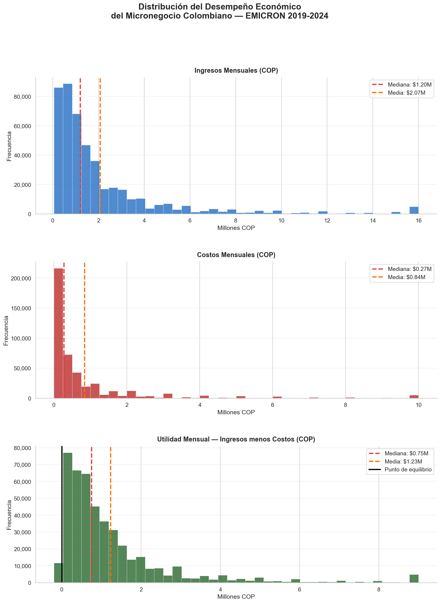
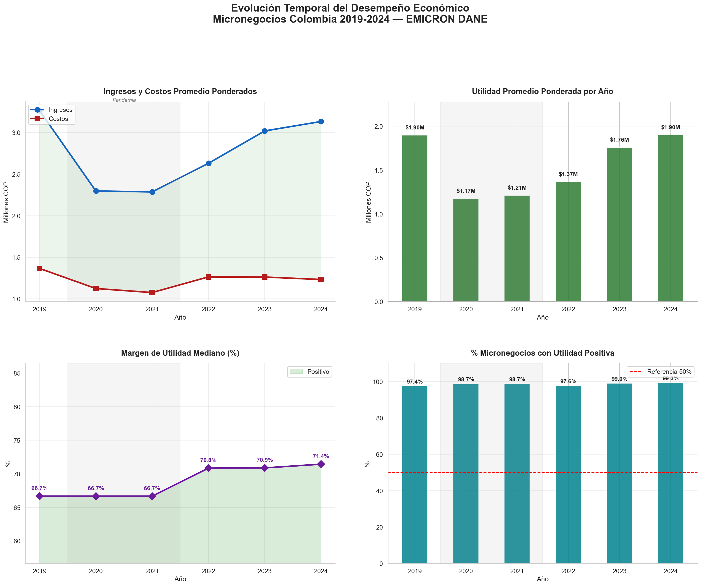
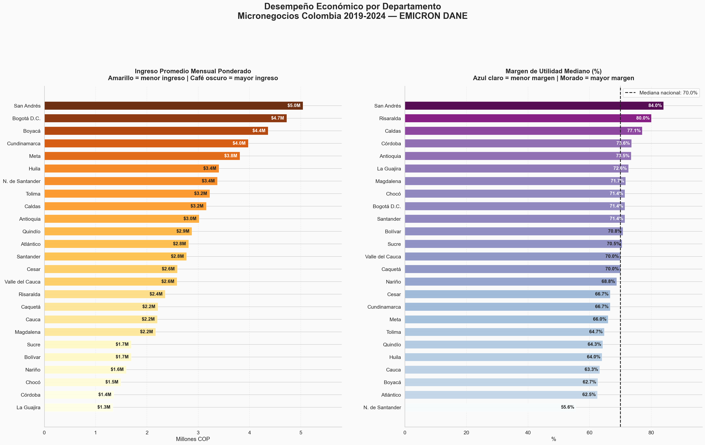
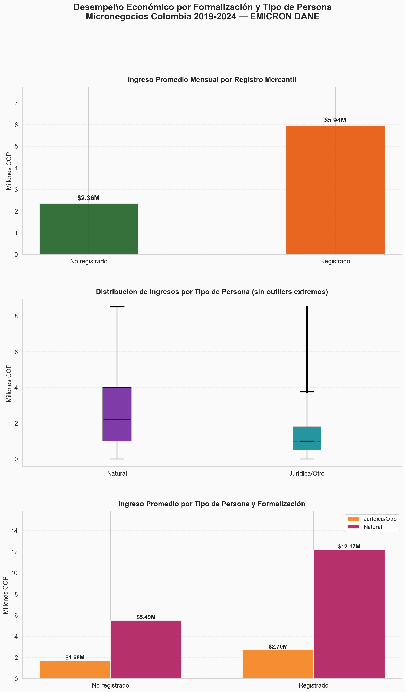
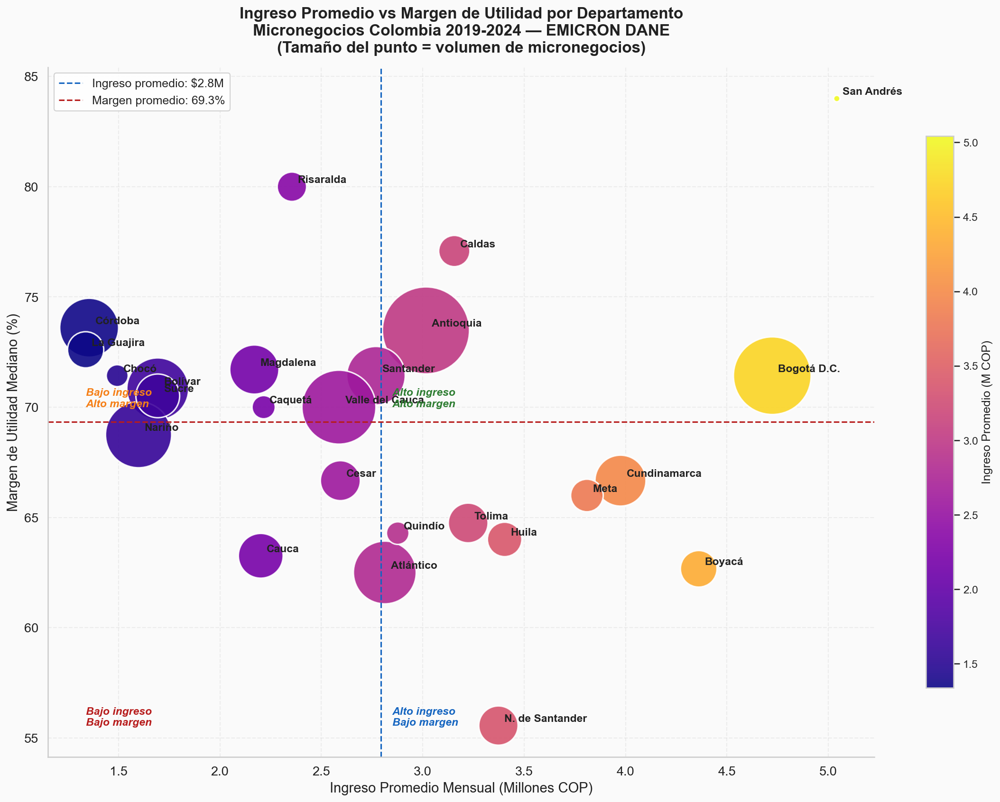

# 📊 Análisis Exploratorio del Desempeño Económico del Micronegocio Colombiano

### EMICRON 2019-2024 — DANE

**Proyecto:** Desarrollo Social y Económico — Universidad Santo Tomás  
**Fecha:** Mayo 2026 | **Pipeline:** Bronze → Silver → Gold — Arquitectura Medallion

---

## 📋 Resumen Ejecutivo

El presente informe presenta los resultados del análisis exploratorio del desempeño económico de los micronegocios colombianos utilizando datos de la Encuesta de Micronegocios (EMICRON) del DANE para el período 2019-2024. Se procesaron **496.274 registros** de 25 departamentos del país, integrando los módulos de ventas, costos e identificación.

| 📦 Registros | ✅ Negocios activos | 💰 Negocios rentables | 💵 Ingreso mediano | 📈 Margen mediano | 🏆 Prima formalización |
> ⚠️ **Nivel geográfico:** Análisis a nivel **departamental**. EMICRON no tiene representatividad municipal.
|:---:|:---:|:---:|:---:|:---:|:---:|
| **496.274** | **92.2%** | **90.8%** | **$1.2M COP/mes** | **69.2%** | **+151.9%** |

---

## ⚙️ Metodología

| Elemento | Descripción |
|---|---|
| **Fuente** | EMICRON 2019-2024 — DANE (Bronze layer) |
| **Módulos** | Ventas/Ingresos, Costos/Gastos, Identificación y Clasificación Económica |
| **Llave de cruce** | DIRECTORIO + SECUENCIA_ENCUESTA + SECUENCIA_P |
| **Ponderación** | Factor de expansión `F_EXP` — media ponderada `wmean()` |
| **Variables clave** | `VENTAS_MES_ANTERIOR`, `COSTOS_MES_ANTERIOR`, `P3031`, `P3000` |
| **Cobertura** | 25 departamentos con representación estadística |

### Indicadores Calculados

| Indicador | Fórmula | Tipo |
|---|---|---|
| Ingreso promedio ponderado | `wmean(VENTAS_MES_ANTERIOR, F_EXP)` | Continuo (COP) |
| Utilidad mensual | `VENTAS − COSTOS` | Continuo (COP) |
| Margen de utilidad | `(UTILIDAD / VENTAS) × 100` | Porcentaje |
| % Negocios rentables | `UTILIDAD > 0` | Proporción |
| Índice de formalización | `P3000 = 1` | Binario |

---

## 📊 Estadísticas Descriptivas Generales

| Estadístico | Ingresos (COP) | Costos (COP) | Utilidad (COP) | Margen (%) |
|:---:|---:|---:|---:|---:|
| **Media** | $2.446.538 | $1.128.772 | $1.317.766 | 61.0% |
| **Desv. Estándar** | $8.102.909 | $5.704.849 | $4.527.400 | 252.0% |
| **Percentil 10** | $89.930 | $0 | $25.000 | 29% |
| **Percentil 25** | $433.333 | $20.000 | $250.000 | 47% |
| **Mediana** | $1.000.000 | $230.000 | $700.000 | 69% |
| **Percentil 75** | $2.200.000 | $800.000 | $1.420.000 | 92% |
| **Percentil 90** | $5.000.000 | $2.000.000 | $2.900.000 | 100% |
| **Máximo** | $1.200.000.000 | $743.000.000 | $900.000.000 | 100% |

> 💡 **Interpretación:** La media de ingresos ($2.4M) duplica la mediana ($1.0M), confirmando que la distribución está fuertemente sesgada hacia la derecha. El micronegocio típico colombiano gana **$1.0M/mes** con un margen del **69%**. La alta desviación estándar evidencia heterogeneidad significativa entre micronegocios.

---

## 📈 Figura 1 — Distribución de Ingresos, Costos y Utilidad

  

<em>Histogramas de ingresos, costos y utilidad mensual. Línea roja = mediana | Línea naranja = media. EMICRON 2019-2024, DANE.</em>

 

> 💡 **Interpretación:**
> - **Ingresos:** Distribución fuertemente sesgada a la derecha. La mayoría de micronegocios gana entre $0 y $2M/mes. La mediana ($1.0M) está muy por debajo de la media ($2.4M), confirmando que pocos negocios con ingresos altos distorsionan el promedio.
> - **Costos:** Concentrados cerca de cero. La mediana de costos ($230.000) refleja que la mayoría opera con estructura de costos mínima — principalmente trabajo familiar sin insumos costosos.
> - **Utilidad:** La mayor parte de observaciones se ubica entre $0 y $1.5M positivo. La línea del punto de equilibrio (utilidad = 0) confirma que la mayoría opera en terreno positivo — 90.8% de negocios rentables.
> - **Implicación:** La **mediana** es el estadístico más apropiado para describir el micronegocio típico colombiano, no la media.

---

## 📅 Figura 2 — Evolución Temporal 2019-2024

  

<em>Evolución de ingresos, costos, utilidad y % rentables. Zona gris = pandemia COVID-19 (2020-2021). EMICRON 2019-2024, DANE.</em>

 

> 💡 **Interpretación:**
> - **Ingresos y costos:** Tendencia creciente sostenida de 2019 a 2024, con caída visible en 2020-2021 por el COVID-19. Los costos crecen a menor ritmo, preservando el margen.
> - **Utilidad promedio:** Positiva en todos los años. La recuperación desde 2022 supera los niveles pre-pandemia, evidenciando resiliencia del sector.
> - **Margen mediano:** Se mantiene por encima del 60% en todo el período, con leve reducción en 2020-2021.
> - **% Rentables:** Estable por encima del 88% en todos los años. La pandemia redujo marginalmente este porcentaje sin cambios dramáticos.
> - **Conclusión:** El sector demostró **alta resiliencia** ante el choque pandémico, con recuperación completa hacia 2022-2024.

---

## 🗺️ Figura 3 — Desempeño Económico por Departamento

  

<em>Ingreso promedio mensual ponderado y margen de utilidad mediano por departamento. EMICRON 2019-2024, DANE.</em>

 

| 🏆 Ranking | Departamento — Mayor Ingreso | Departamento — Mayor Margen |
|:---:|:---:|:---:|
| 🥇 1° | Boyacá | Caldas |
| 🥈 2° | Bogotá D.C. | Risaralda |
| 🥉 3° | San Andrés | San Andrés |

**Mediana nacional de margen: 70.0%**

 

> 💡 **Interpretación:**
> - **Liderazgo en ingresos:** Boyacá, Bogotá D.C. y San Andrés encabezan el ranking, reflejando mayor capacidad productiva en estas regiones.
> - **Liderazgo en margen:** Caldas, Risaralda y San Andrés tienen los márgenes más altos. El Eje Cafetero destaca por eficiencia en la relación ingresos-costos.
> - **Disociación ingreso-margen:** No existe correlación perfecta entre mayor ingreso y mayor margen, sugiriendo estructuras de costos más complejas en departamentos de mayor ingreso.
> - **Heterogeneidad territorial:** La variación entre departamentos evidencia la necesidad de políticas territoriales diferenciadas para el sector.

---

## 📋 Figura 4 — Formalización y Tipo de Persona

  

<em>Ingreso promedio por registro mercantil, distribución por tipo de persona e ingreso cruzado. EMICRON 2019-2024, DANE.</em>

 

| Categoría | Ingreso Promedio Ponderado | Diferencia |
|:---:|:---:|:---:|
| ✅ **Registrado** (Cámara de Comercio) | **$5.940.000 COP/mes** | **+151.9%** |
| ❌ **No registrado** (informal) | $2.360.000 COP/mes | — |

 

> 💡 **Interpretación:**
> - **Prima de formalización:** Los micronegocios registrados ganan **$5.94M/mes** vs **$2.36M** los no registrados. La diferencia del **151.9%** es el hallazgo más robusto del análisis y con mayor implicación de política pública.
> - **Tipo de persona:** Las personas jurídicas presentan mayor dispersión de ingresos, con micronegocios tanto muy exitosos como con dificultades.
> - **Cruce tipo × formalización:** En ambos tipos de persona, los registrados tienen ingresos significativamente mayores. La brecha es más pronunciada en personas jurídicas.
> - **Implicación:** Programas de formalización empresarial podrían tener alto retorno en términos de mejora del ingreso para los microempresarios colombianos.

---

## 🔵 Figura 5 — Ingreso vs Margen por Departamento

  

<em>Relación entre ingreso promedio y margen de utilidad por departamento. Tamaño del punto = volumen de micronegocios (F_EXP). EMICRON 2019-2024, DANE.</em>

 

> 💡 **Interpretación:**
> - **Cuatro perfiles:** Los cuadrantes identifican: (1) alto ingreso y alto margen — más competitivos, (2) alto ingreso y bajo margen — eficientes en escala pero con costos altos, (3) bajo ingreso y alto margen — pequeños pero eficientes, (4) bajo ingreso y bajo margen — más vulnerables.
> - **Relación no lineal:** No existe correlación lineal clara. Mayores ingresos no garantizan mayor rentabilidad relativa, indicando estructuras de costos heterogéneas entre territorios.
> - **Priorización:** Los departamentos del cuadrante inferior izquierdo requieren intervención prioritaria. Los del cuadrante superior derecho pueden servir como casos de éxito replicables.

---

## 🎯 Hallazgos Principales

| # | Hallazgo | Valor clave |
|:---:|---|:---:|
| 1 | Alta actividad económica — sector activo aunque con ingresos bajos | 92.2% activos |
| 2 | Desigualdad interna pronunciada — el micronegocio típico gana $1.0M/mes | Media = 2× mediana |
| 3 | Resiliencia ante COVID-19 — recuperación completa hacia 2022 | > niveles pre-pandemia |
| 4 | Heterogeneidad territorial significativa — Boyacá, Bogotá y San Andrés lideran | 25 deptos analizados |
| 5 | **Prima de formalización del 151.9%** — hallazgo más robusto | $5.94M vs $2.36M/mes |
| 6 | Margen mediano alto (69.2%) — viabilidad económica del sector | 90.8% rentables |

---

## ✅ Conclusiones

### 1. Viabilidad económica
Los micronegocios colombianos son económicamente viables — más del 90% opera con utilidad positiva. Sin embargo, la escala de ingresos es insuficiente para generar bienestar significativo para los hogares dependientes de este sector.

### 2. Formalización como palanca de desarrollo
La diferencia del **151.9%** en ingresos entre formalizados e informales es el argumento más sólido para promover programas de formalización empresarial como estrategia de reducción de brechas económicas.

### 3. Resiliencia sectorial
El sector demostró capacidad de recuperación ante el COVID-19, con retorno completo a tendencias pre-pandemia hacia 2022, sugiriendo mecanismos de adaptación propios del sector.

### 4. Brechas territoriales
La heterogeneidad inter-departamental es significativa. Se requieren intervenciones territorialmente diferenciadas que atiendan las particularidades de cada región.

---

## ⚠️ Limitaciones

- **EMICRON no tiene representatividad municipal** — el análisis es exclusivamente a nivel departamental. No es posible desagregar estos resultados por municipio con esta fuente.
- El cruce con SECOP (que opera a nivel municipal) implica una agregación geográfica heterogénea que debe interpretarse con cautela — los resultados son indicativos, no concluyentes.
- Los datos de formalización (`P3031`, `P3000`) solo están disponibles en algunos años de la encuesta.
- Los ingresos reportados pueden subestimar la realidad por subdeclaración en negocios informales.
- La relación entre formalización e ingresos es correlacional, no necesariamente causal.
- La cobertura EMICRON excluye departamentos con baja densidad poblacional.

---

## 📁 Archivos Relacionados

| Archivo | Descripción |
|---|---|
| [`notebooks/ANALISIS_INDICADOR_EMICRON.ipynb`](../notebooks/ANALISIS_INDICADOR_EMICRON.ipynb) | Notebook completo con código y gráficas |
| [`src/visualizacion/fig1_distribucion.png`](../src/visualizacion/fig1_distribucion.png) | Distribución de ingresos, costos y utilidad |
| [`src/visualizacion/fig2_evolucion_temporal.png`](../src/visualizacion/fig2_evolucion_temporal.png) | Evolución temporal 2019-2024 |
| [`src/visualizacion/fig3_departamentos.png`](../src/visualizacion/fig3_departamentos.png) | Desempeño por departamento |
| [`src/visualizacion/fig4_formalizacion.png`](../src/visualizacion/fig4_formalizacion.png) | Análisis por formalización y tipo de persona |
| [`src/visualizacion/fig5_scatter_deptos.png`](../src/visualizacion/fig5_scatter_deptos.png) | Scatter ingreso vs margen por departamento |

---

*Análisis elaborado con datos del DANE — EMICRON 2019-2024*  
*Pipeline de datos: Bronze → Silver → Gold — Arquitectura Medallion*  
*Proyecto: Desarrollo Social y Económico — Universidad Santo Tomás | Mayo 2026*

