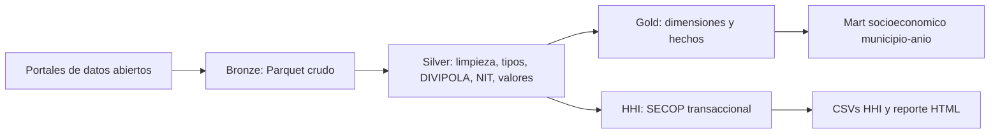
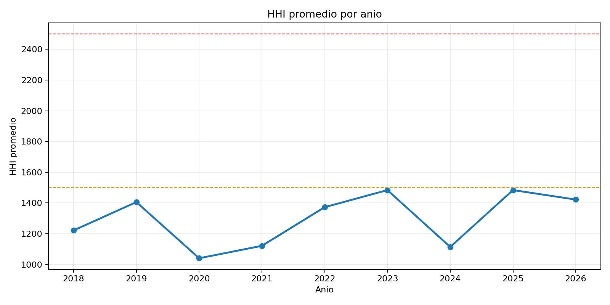
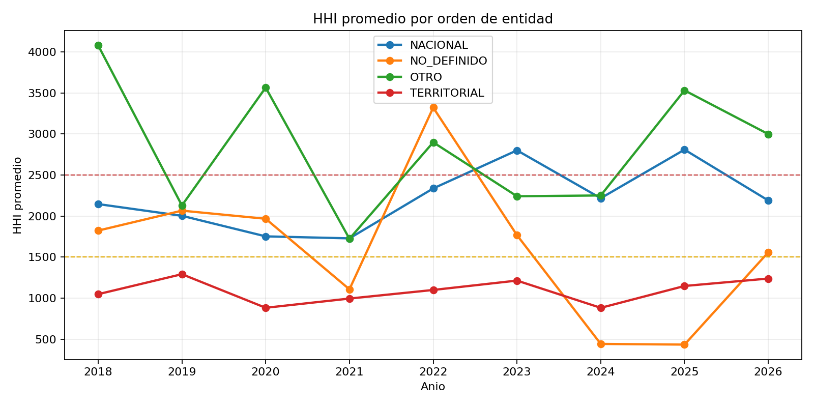
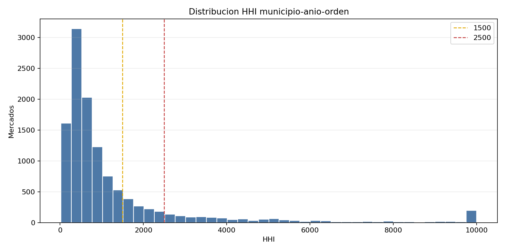

# Concentración de la contratación pública territorial en Colombia mediante el Índice Herfindahl-Hirschman

**Proyecto:** Sinergia socioeconómica: contratación pública, estructura territorial y economía popular  
**Equipo:** Consultorio de Estadística USTA - Observatorio Ustadística 2026-I  
**Repositorio:** `desarrollo_social_y_economico`  
**Periodo analítico principal:** 2018-2026  
**Fecha de consulta de catálogos fuente:** 27 de mayo de 2026  
**Fecha de materialización local de datos y artefactos:** mayo de 2026  

---

## Resumen ejecutivo

Este informe presenta la metodología y los resultados del Índice Herfindahl-Hirschman (HHI) aplicado a la contratación pública colombiana registrada en SECOP I y SECOP II. El indicador se calcula a partir de contratos transaccionales en la capa Silver del pipeline Medallion, con deduplicación por `id_contrato`, normalización territorial mediante DIVIPOLA y segmentación por `orden_entidad`.

El mercado estadístico se define como:

```text
anio_key x divipola_key x orden_entidad
```

El HHI promedio nacional anual se mantiene entre **1,040.57** y **1,484.07** durante 2018-2026. Esta magnitud es coherente con una definición amplia de mercado municipal-año-orden, donde numerosos contratos y proveedores reducen la concentración promedio. La dimensión nacional presenta mayor concentración que la territorial en la mayoría de años, pero la evidencia no sugiere monopolización generalizada de la contratación pública.

El pipeline integra además información social y demográfica del DANE: CNPV 2018, proyecciones de población 2018-2050 y EMICRON 2019-2024. Estas fuentes no intervienen en la fórmula del HHI, pero documentan el contexto de cruce socioeconómico y sostienen el mart analítico usado para nombres geográficos, población, micronegocios y variables complementarias.

---

## 1. Contextualización del problema

La contratación pública es uno de los canales principales mediante los cuales el Estado distribuye recursos, ejecuta política pública y dinamiza mercados regionales. En Colombia, la información contractual se publica en el Sistema Electrónico para la Contratación Pública (SECOP), operado por Colombia Compra Eficiente y disponible en Datos Abiertos Colombia.

Desde una perspectiva estadística, una pregunta central es si el valor contratado por entidades públicas se distribuye entre múltiples proveedores o si se concentra en pocos contratistas. La concentración puede reflejar especialización técnica, economías de escala o proyectos de gran tamaño, pero también puede indicar baja competencia, barreras de entrada, dependencia institucional o riesgos de captura de rentas. Por esa razón se usa el HHI, una medida estándar de concentración de mercado basada en la suma de los cuadrados de las participaciones.

El análisis se realiza a escala territorial porque el impacto socioeconómico de la contratación depende del lugar donde se registra la entidad contratante, del orden institucional de la compra y del tamaño del mercado local. El informe articula el cálculo del HHI con una arquitectura reproducible de datos abiertos: ingesta, limpieza, normalización, cruce y generación de artefactos.

---

## 2. Objetivos

**Objetivo general.** Medir y describir la concentración de la contratación pública en Colombia para 2018-2026 mediante el HHI, usando datos abiertos SECOP procesados en una arquitectura Medallion reproducible.

**Objetivos específicos.**

1. Consolidar contratos de SECOP I y SECOP II en una base transaccional homogénea.
2. Normalizar llaves territoriales, temporales, monetarias e identificadores de proveedor.
3. Calcular el HHI por mercado `municipio x año x orden_entidad`.
4. Resumir la concentración por año, orden de entidad, departamento y municipio.
5. Documentar la trazabilidad de fuentes, transformaciones, supuestos y artefactos.
6. Proponer recomendaciones analíticas y técnicas para el uso del indicador.

---

## 3. Fuentes de datos abiertos

**Tabla 1. Fuentes de datos utilizadas y trazabilidad de origen**

| Fuente | Portal / entidad | Identificador / catálogo | Periodo usado | Fecha de consulta | Uso en el proyecto |
|---|---|---|---|---|---|
| SECOP I - Procesos de Compra Pública | Datos Abiertos Colombia / Colombia Compra Eficiente | `f789-7hwg` | 2018-2026 en datos materializados | 2026-05-27 | Contratos, valor, fecha, proveedor, DIVIPOLA y orden de entidad |
| SECOP II - Contratos Electrónicos | Datos Abiertos Colombia / Colombia Compra Eficiente | `jbjy-vk9h` | 2018-2026 en datos materializados | 2026-05-27 | Contratos, valor, fecha, proveedor, DIVIPOLA y orden de entidad |
| CNPV 2018 - Censo Nacional de Población y Vivienda | DANE - Archivo Nacional de Datos | Catálogo `643`, estudio `DANE-DCD-CNPV-2018` | 2018 | 2026-05-27 | Población censal base y atributos territoriales complementarios |
| EMICRON - Encuesta de Micronegocios | DANE - Microdatos / EMICRON | Estudios anuales `DANE-DIMPE-EMICRON-YYYY`; referencia 2024 catálogo `875` | 2019-2024 | 2026-05-27 | Volumen expandido de micronegocios por departamento-año |
| Proyecciones de población | DANE - Proyecciones de población | Serie 2018-2050 basada en CNPV 2018 | 2018-2050 en Silver; 2018-2029 en mart | 2026-05-27 | Población proyectada para indicadores per cápita y contexto |
| Catálogo DIVIPOLA | DANE / catálogo territorial del proyecto | `src/utils/divipola_catalog.py` | Vigente en pipeline | 2026-05-27 | Homologación de códigos, municipios, departamentos y regiones |

**Observación sobre acceso.** La ingesta reproduce los archivos oficiales descargados desde los portales mediante parsers locales hacia Parquet Bronze. Los identificadores de Datos Abiertos Colombia permiten consulta vía API Socrata (`https://www.datos.gov.co/resource/<id>.json`) o descarga directa desde el portal.

---

## 4. Arquitectura de datos y repositorio

El repositorio organiza el flujo en tres capas:

```text
data/bronze/      datos crudos convertidos a Parquet
data/silver/      datos limpios, tipados y homologados
data/gold/        hechos, dimensiones y mart analítico
src/              código de ingesta, transformación, features y validación
scripts/          generación de reportes y artefactos
docs/             documentación técnica y metodológica
notebooks/        análisis exploratorio y notebooks reproducibles
artifacts/        reportes HTML e imágenes generadas
tests/            pruebas unitarias y de regresión
```

**Figura 1. Flujo Medallion del proyecto**



**Scripts reproducibles principales**

| Propósito | Comando / archivo |
|---|---|
| Pipeline completo | `python -m src.cli all` o `socioeco-pipeline` |
| Capa Bronze | `python -m src.cli bronze` |
| Capa Silver | `python -m src.cli silver` |
| Capa Gold | `python -m src.cli gold` |
| HHI desde Silver | `python -m src.features.indicador_hhi_cruce` |
| Reporte HTML HHI | `python scripts/generar_graficas_hhi.py` |
| Validación HHI | `python -m pytest tests/test_indicador_hhi_cruce.py` |

---

## 5. Tratamiento de los datos

Esta sección documenta de forma exhaustiva la ingesta, limpieza, integración y validación de las fuentes que alimentan el cálculo del HHI. La arquitectura Medallion (Bronze → Silver → Gold) garantiza trazabilidad, idempotencia, separación de responsabilidades y reproducibilidad: cualquier integrante del equipo puede regenerar todo el pipeline con `python -m src.cli all`.

### 5.1 Stack tecnológico

| Componente | Tecnología | Justificación |
|---|---|---|
| Lectura CSV masiva | `pandas.read_csv` con chunks | Maneja archivos de 10 GB con 8 GB de RAM. |
| Escritura Parquet | `pyarrow.parquet.ParquetWriter` | Escritura streaming chunk-a-chunk sin acumular en RAM. |
| Estandarización geográfica | Catálogo DIVIPOLA embebido en `src/utils/divipola_catalog.py` | Sin dependencia de API externa para mapear municipios. |
| Detección de encoding | `chardet` | EMICRON viene en latin-1, SECOP en UTF-8; detección automática. |
| Orquestación | Python puro (clases Orchestrator) | Sin dependencia de Airflow/Prefect para un proyecto académico. |
| Motor analítico | pandas + PyArrow (default), PySpark opcional con auto-fallback | Suficiente para ~2 M filas; sin JVM requerido. |

**¿Por qué Parquet y no CSV/SQLite?** Compresión columnar 5× (de ~10 GB CSV a ~1-2 GB Parquet), tipos preservados (sin que pandas convierta NITs a entero perdiendo ceros), lectura parcial por columnas y sin servidor.

**Nota sobre ingesta:** toda la ingesta se realiza exclusivamente desde **archivos CSV locales** descargados manualmente de los portales oficiales. El proyecto no consume APIs en tiempo real para garantizar reproducibilidad offline.

### 5.2 Capa Bronze — ingesta cruda

#### 5.2.1 Orquestador

El módulo `src/ingesta/bronze/main_ingestion.py` define `IngestionOrchestrator` con un diccionario `SOURCES_CONFIG` que asocia cada fuente con su parser:

```python
SOURCES_CONFIG = {
    "cnpv":         {"parser": parse_cnpv_csv},
    "secop_i":      {"parser": parse_secop_i_csv},
    "secop_ii":     {"parser": parse_secop_csv},
    "emicron":      {"parser": parse_emicron_csv},
    "proyecciones": {"parser": parse_proyecciones_csv},
}
```

Para cada fuente: verifica si existe Parquet previo (skip salvo `--force`), ejecuta el parser, valida con `bronze_validator.py` y emite reporte en `documentacion_tecnica/BRONZE_VALIDATION_REPORT.md`.

#### 5.2.2 Parsers SECOP I y SECOP II

Ambos parsers (`parser_csv_secop_i.py`, `parser_csv_secop.py`) siguen el patrón:

```python
for chunk in pd.read_csv(
    input_path,
    chunksize=250_000,
    sep=",",
    dtype=str,
    keep_default_na=False,
    low_memory=False,
    encoding="utf-8",
    on_bad_lines="warn",
):
    chunk["_ingestion_timestamp"] = datetime.now().isoformat()
    chunk["_source"] = "secop_ii_csv"
    chunk["_checksum_md5"] = pd.util.hash_pandas_object(chunk).astype(str)
    table = pa.Table.from_pandas(chunk)
    writer.write_table(table)
```

Decisiones críticas:

- `dtype=str`: la tipificación ocurre en Silver. Evita que pandas interprete montos como `float` y pierda precisión, o que recorte ceros a la izquierda de NITs.
- `keep_default_na=False`: algunos campos legítimamente contienen la cadena "NA"; sin este flag se convertirían a `NaN`.
- `on_bad_lines="warn"`: los CSV de SECOP tienen ocasionalmente comillas desbalanceadas. Se salta la línea y se emite advertencia en lugar de abortar la ingesta.

#### 5.2.3 Parser CNPV

CNPV tiene estructura jerárquica (carpetas por departamento, archivos por módulo censal `1VIV`, `2HOG`, `3FALL`, `5PER`, `MGN`). El parser hace descubrimiento por glob, detecta separador (`;` vs `,`) leyendo la primera línea y genera un Parquet por módulo: `cnpv_1viv_raw.parquet`, `cnpv_2hog_raw.parquet`, etc.

#### 5.2.4 Parser EMICRON

El más complejo por heterogeneidad: busca carpetas `EMICRON YYYY` (2019-2024), detecta encoding por archivo con `chardet` sobre muestra de 100 KB, detecta separador analizando primeras 10 líneas y normaliza nombres con acentos/espacios a snake_case.

#### 5.2.5 Parser Proyecciones

Lee el CSV oficial DANE (separador `;`), preserva área y departamento, escribe `proyecciones_censo_raw.parquet`.

#### 5.2.6 Metadatos de trazabilidad Bronze

Cada Parquet de Bronze incluye:

- `_ingestion_timestamp`: momento exacto de la ingesta.
- `_source`: identificador (`secop_ii_csv`, `dane_cnpv`, etc.).
- `_source_version`: versión del dataset.
- `_extraction_method`: `CSV_LOCAL_PARSER`.
- `_checksum_md5`: hash por fila o por lote.

### 5.3 Configuración y resolución de rutas

#### 5.3.1 Estrategia de búsqueda

`src/config/settings.py` resuelve rutas con esta jerarquía:

```python
candidate_paths = [
    PROJECT_ROOT / "Datos",
    PROJECT_ROOT.parent / "Datos",
    PROJECT_ROOT.parent.parent / "Datos",
]
```

Para SECOP I y II usa glob patterns para no atarse al nombre exacto del archivo (incluye fecha de descarga):

```python
SECOP_I_CSV_PATH = _resolve_glob_path(datos_folder, "SECOP_I_-_Procesos_de_Compra*.*csv")
SECOP_CSV_PATH   = _resolve_glob_path(datos_folder, "SECOP_II_-_Contratos_Electr*.*csv")
```

Las rutas pueden sobrescribirse vía `.env`: `SECOP_CSV_PATH`, `SECOP_I_CSV_PATH`, `CNPV_ROOT_DIR`, `EMICRON_CSV_PATH`, `PROYECCIONES_CENSO_PATH`. Umbrales de calidad configurables: `NULL_THRESHOLD_WARNING=0.5`, `NULL_THRESHOLD_BLOCKING=0.9`.

#### 5.3.2 Validador previo

Antes de correr Bronze por primera vez se ejecuta:

```bash
python -m src.validadores.verificar_datos
```

Verifica que exista `Datos/` en alguna de las tres ubicaciones candidatas, que estén las subcarpetas (`CENSO 2018 dep/`, `EMICRON 2024/`) y que existan los CSV de SECOP I, SECOP II y proyecciones. Si todo aparece marcado `OK`, la ingesta debería pasar; en caso contrario, hay que mover `Datos/` o configurar `.env`.

### 5.4 Capa Silver — limpieza y estandarización

#### 5.4.1 Patrón general

`src/transformacion/silver/main_transformation.py` ejecuta un cleaner por fuente; cada cleaner: (1) lee Parquet de Bronze, (2) normaliza texto (NFKC + eliminación de caracteres de control), (3) estandariza nombres a `snake_case`, (4) tipifica (`float64` para montos, `string` con `zfill(5)` para DIVIPOLA, `datetime` para fechas), (5) estandariza geográficamente, (6) agrega a municipio-año (o depto-año en EMICRON/Proyecciones) y (7) escribe a `data/silver/`.

#### 5.4.2 Módulos compartidos

- **`transform/clean_text.py`** — Normalización Unicode `unicodedata.normalize('NFKC', text)`, eliminación de caracteres de control con `re.sub(r'[\x00-\x08\x0B\x0C\x0E-\x1F\x7F-\x9F]', '', text)`, estandarización de caso y conversión a snake_case.
- **`transform/standardize_geo.py`** — Mapeo DIVIPOLA. SECOP I no contiene código DIVIPOLA: trae `Municipio Entidad` como texto. Se mantiene un catálogo embebido con los 1,102 municipios y un índice inverso por nombre normalizado. Se generan variantes automáticas: `Bogotá D.C.` → `["bogota dc", "bogota", "bogota d.c."]`. Si existe `data/bronze/divipola/divipola_oficial.csv`, se carga como fallback.
- **`transform/type_cast.py`** — Esquema `PLATA_SCHEMA` con tipos PyArrow: `divipola_municipio` como `string[pyarrow]` para preservar ceros, `monto_contrato` como `float64[pyarrow]`, `ipm_total` como `float32[pyarrow]`, `total_micronegocios` como `int32[pyarrow]`, `es_economia_popular` como `bool[pyarrow]`.

#### 5.4.3 Cleaner SECOP I (`clean_secop_i.py`)

1. Lee todos los Parquet bajo `data/bronze/secop_i/` recursivamente.
2. Resuelve nombres reales de columnas (con tildes y espacios) vía índice normalizado `_norm`: `UID`, `Fecha de Firma del Contrato`, `Cuantia Contrato`, `Identificacion del Contratista`, `Departamento Entidad`, `Municipio Entidad`.
3. **Resolución de `divipola_key` por prioridad**:
   1. `DIVIPOLA_KEY_MAPPED` (si el parser de Bronze ya lo inyectó).
   2. `CODIGO_MUNICIPIO_ENTIDAD` cuando viene poblado.
   3. Lookup `(_norm(departamento), _norm(municipio))` contra `DIVIPOLA_COMPLETO` con alias para Bogotá D.C. (`BOGOTA_D_C` ↔ `BOGOTA`).
4. Limpieza monetaria colombiana: `"$1.234.567,89"` → `1234567` eliminando todo carácter no dígito.
5. Extrae año desde `fecha_firma` intentando `DD/MM/YYYY` y luego ISO.
6. NIT: solo dígitos, preservado como string para `COUNT(DISTINCT)` en Gold.
7. **Filtros de calidad**: `divipola_key` debe coincidir con `^\d{5}$`; `anio_key` no nulo en rango `[2018, 2030]`.
8. Genera dos salidas: `silver_secop_i_transaccional.parquet` (grano contrato; insumo del HHI sin doble conteo) y `silver_secop_i_agregado.parquet` (grano municipio-año con `COUNT(DISTINCT nit)`).

#### 5.4.4 Cleaner SECOP II (`clean_secop_ii.py`)

Mismo patrón con nombres reales propios: `ID Contrato`/`Referencia del Contrato`, `Fecha de Firma`, `Valor del Contrato`, `Documento Proveedor`. La `divipola_key` prioriza `DIVIPOLA_KEY_MAPPED` → `COD_MUNICIPIO`/`CODIGO_MUNICIPIO` → lookup `Departamento + Ciudad` con alias para Bogotá. **Importante**: `Codigo Entidad` **no es DIVIPOLA** en SECOP II (es NIT de la entidad); por eso no se usa.

#### 5.4.5 Clasificación de `orden_entidad`

El cálculo HHI admite dos rutas equivalentes para `orden_entidad`: lectura directa desde Silver cuando la columna está materializada, o reconstrucción desde Bronze usando los nombres oficiales (`Orden Entidad` en SECOP I, `Orden` en SECOP II) mediante la función `classify_order` en `src/features/indicador_hhi_cruce.py`. La función agrupa los valores en `NACIONAL`, `TERRITORIAL`, `OTRO` o `NO_DEFINIDO` y no imputa faltantes como territoriales.

#### 5.4.6 Cleaner CNPV (`clean_cnpv.py`)

**Aclaración importante:** versiones previas del informe técnico afirmaban que el cleaner extraía IPM, NBI y déficit habitacional. La revisión del código confirma que **eso no es así**:

1. Lee los Parquet por módulo (viviendas, hogares, personas, MGN).
2. Solo emite la columna geográfica `divipola_key` (línea 76 de `clean_cnpv.py`: `dfs.append(df_part[["divipola_key"]])`).
3. Agrega a nivel municipio como conteo de población base (`poblacion_total_base`) — equivale a `COUNT(*)` sobre el módulo de personas.
4. Genera `silver_cnpv_agregado.parquet` con `anio_key = 2018`.

**Consecuencia para el HHI:** la sección demográfica del mart aporta nombres, departamentos y región vía LEFT JOIN sobre `divipola_key`, pero **no provee indicadores de pobreza** (NBI/IPM). Esto no afecta el cálculo del HHI (que solo necesita SECOP transaccional), pero sí limita cruces analíticos posteriores.

#### 5.4.7 Cleaner EMICRON (`clean_emicron.py`)

1. Lee todos los Parquet por año (2019-2024).
2. Identifica variables de micronegocios, ventas, empleo.
3. Construye `factor_expansion`: usa `F_EXP` cuando viene válido; si un año queda en cero, fusiona archivos de factores (`fex_c`/`FEX_C`; `fex_micro_dpto` como respaldo) por `(DIRECTORIO, SECUENCIA_P, SECUENCIA_ENCUESTA, año)`.
4. Agrega a nivel **departamental** (EMICRON es encuesta muestral). DIVIPOLA para departamentos usa formato `XX000` (`05000` para Antioquia).
5. Genera `silver_emicron_agregado.parquet`.

#### 5.4.8 Cleaner Proyecciones (`clean_proyecciones.py`)

Lee `proyecciones_censo_raw.parquet`, identifica columnas de año y población y genera serie temporal por departamento. **Limitación crítica:** la salida queda a granularidad **departamento-año** (códigos `XX000`); no se desagrega a municipio. Por eso `fact_demografia_municipio_anio.parquet` solo tiene valores no nulos en los códigos `XX000`. El HHI no usa esta tabla directamente (se calcula sobre el valor de los contratos), pero conviene tenerla en cuenta para indicadores per cápita complementarios.

### 5.5 Sesgo crítico de atribución geográfica en SECOP ★

**Advertencia obligatoria al usar cualquier indicador territorial derivado de SECOP, incluido el HHI.**

En los cleaners de SECOP I y SECOP II, la `divipola_key` se construye a partir de `Municipio Entidad + Departamento Entidad` (o `Ciudad + Departamento` en SECOP II). Es decir: **el municipio del contrato es el municipio de la entidad contratante, no el municipio donde se ejecuta el contrato**.

Esto produce un sesgo sistemático en favor de Bogotá D.C. (`11001`):

| Año | Cuota de Bogotá en monto total |
|---:|---:|
| 2018 | 50.2 % |
| 2019 | 42.6 % |
| 2020 | 41.2 % |
| 2021 | 47.2 % |
| 2022 | 54.3 % |
| 2023 | 38.0 % |
| 2024 | 34.1 % |

La razón es estructural: todas las entidades del **orden nacional** (Presidencia, ministerios, ICBF, Invías, Fuerzas Militares, agencias) tienen sede en Bogotá; SECOP registra `Municipio Entidad = "BOGOTA D.C."` para todas ellas y, en consecuencia, esos contratos quedan imputados a `11001` aunque se ejecuten en otros municipios.

**Mitigación aplicada en el HHI.** El indicador segmenta el mercado por `orden_entidad`, lo que permite leer separadamente el HHI nacional (afectado por el sesgo de Bogotá) del HHI territorial (más fiel a la concentración local). Las tablas 4 y 6 reportan ambas series; cualquier interpretación municipal estricta debe priorizar `orden_entidad = TERRITORIAL`.

### 5.6 Cruce SECOP I + SECOP II: deduplicación y doble conteo

#### 5.6.1 Problema

SECOP I y SECOP II son plataformas distintas de Colombia Compra Eficiente. Un mismo contrato puede aparecer en ambas durante la transición de procesos, y un mismo proveedor (NIT) puede tener contratos en las dos. Sumar ingenuamente las dos plataformas infla la inversión total y el conteo de proveedores.

#### 5.6.2 Solución implementada (HHI + Gold)

`src/features/indicador_hhi_cruce.py::load_transactions` y `src/transformacion/gold/build_facts.py::_build_fact_contratacion` aplican el mismo algoritmo:

1. Concatena `silver_secop_i_transaccional.parquet` + `silver_secop_ii_transaccional.parquet`.
2. Descarta filas con `divipola_key` o `anio_key` nulos, o con `valor_del_contrato <= 0`.
3. **Deduplica por `id_contrato`** con `drop_duplicates(keep="first")` para que un contrato presente en ambas plataformas no infle `inversion_total`.
4. Agrupa por las claves del análisis:
   - HHI: `(anio_key, divipola_key, orden_entidad, nit_contratista)`.
   - Fact contratación Gold: `(divipola_key, anio_key)` con `proveedores_unicos = nunique(nit_contratista)` para que un NIT en ambas plataformas cuente UNA sola vez.

#### 5.6.3 Llave de cruce: `divipola_key` de 5 dígitos

Se eligió DIVIPOLA como llave única porque (a) es el estándar oficial DANE para identificar municipios, (b) es numérico y no ambiguo (a diferencia de nombres con homónimos: "Armenia" existe en Antioquia y Quindío), (c) tiene exactamente 5 dígitos: los 2 primeros identifican departamento, los 3 últimos municipio, y (d) se estandariza con `str.zfill(5)` para garantizar ceros a la izquierda.

#### 5.6.4 Tipos de join utilizados en el mart Gold

| Join | Tablas | Tipo | Justificación |
|---|---|---|---|
| SECOP I + SECOP II → `fact_contratacion` | UNION + GROUP BY | Unión vertical + agregación con deduplicación | Evitar doble conteo de contratos y NITs presentes en ambas plataformas. |
| `fact_contratacion` + `dim_territorio` | LEFT JOIN on `divipola_key` | Left | No perder contratos aunque el municipio no esté en catálogo. |
| `fact_contratacion` + `dim_tiempo` | LEFT JOIN on `anio_key` | Left | Enriquecer con atributos temporales. |
| `fact_censo` → mart | LEFT JOIN on `divipola_key` (sin año) | Broadcast | CNPV 2018 es snapshot fijo; se propaga a todos los años. |
| `fact_micronegocios` + mart | LEFT JOIN on `(divipola_key, anio_key)` | Left | EMICRON es departamental; solo el agregado `XX000` tiene valor. |
| `fact_demografia` + mart | LEFT JOIN on `(divipola_key, anio_key)` | Left | Proyecciones DANE departamentales. |

### 5.7 Restricciones legales del cruce

El DANE opera bajo **secreto estadístico** (Ley 79 de 1993):

- **No** se puede cruzar el NIT de proveedores SECOP directamente con microdatos censales del DANE.
- Solo se permiten **agregaciones geográficas** (municipio o departamento).
- El cruce es siempre SECOP(municipio) ↔ DANE(municipio), nunca SECOP(proveedor) ↔ DANE(persona).

El cálculo del HHI no requiere ni propone ningún cruce a nivel de persona; usa exclusivamente la información transaccional pública de SECOP I + II.

### 5.8 Capa Gold — modelo estrella y datamart

#### 5.8.1 Dimensiones

- **`dim_tiempo`** (`build_dim_tiempo`): años 2018-2029 con atributos `es_anio_electoral_presidencial`, `es_anio_electoral_regional`, `es_pandemia`. PK `anio_key`.
- **`dim_territorio`** (`build_dim_territorio`): base de 1,102 municipios DIVIPOLA, enriquecida escaneando todos los Parquet de Silver para detectar `divipola_key` fuera de catálogo. Códigos `XX000` se marcan como "Agregado departamental"; municipios no catalogados como "Municipio sin catalogar" conservando el departamento. PK `divipola_key`.

#### 5.8.2 Tablas de hechos

| Fact | Fuente Silver | Grano | Campos |
|---|---|---|---|
| `fact_contratacion` | SECOP I + II transaccionales | municipio-año | procesos, inversión, proveedores únicos |
| `fact_censo` | CNPV 2018 | municipio (año fijo 2018) | población base |
| `fact_micronegocios` | EMICRON | departamento-año | volumen expandido |
| `fact_demografia` | Proyecciones DANE | departamento-año | población proyectada |

#### 5.8.3 Datamart OBT (`build_mart.py`)

1. **Spine**: pares `(divipola_key, anio_key)` que aparecen en al menos un fact real, acotados al rango de `dim_tiempo` (2018-2029). No es producto cartesiano.
2. **Inclusión de filas solo-censo**: municipios con dato en `fact_censo` se cruzan con los años existentes para no perder cobertura.
3. LEFT JOIN secuencial con `dim_territorio`, `dim_tiempo`, `fact_contratacion`, `fact_micronegocios`, `fact_demografia`.
4. **Broadcast `fact_censo`** por `divipola_key` (sin año) para propagar `poblacion_censo_2018`.

**Indicadores derivados en el mart**:

- `indicador_inversion_per_capita = inversion_total_monto / poblacion`.
- `indicador_densidad_micronegocios = volumen_micronegocios_exp / poblacion`.

Donde `poblacion` toma `poblacion_censo_2018` cuando es > 0 y cae a `poblacion_total_proyectada` en otros casos.

**Flags de trazabilidad**: `tiene_componente_social = (poblacion_total_proyectada > 0) | (poblacion_censo_2018 > 0)`; `tiene_componente_economico = (inversion_total_monto > 0) | (volumen_micronegocios_exp > 0)`.

**Versionamiento**: se generan `marts/version_YYYYMMDD/` y `marts/latest/`.

### 5.9 Volumen materializado y validación

#### 5.9.1 Tabla 2. Volumen por capa

| Artefacto | Ruta | Filas | Columnas | Cobertura temporal | Cobertura territorial |
|---|---|---:|---:|---|---:|
| Bronze SECOP I | `data/bronze/secop_i/secop_i_raw.parquet` | 6,354,773 | 84 | Fuente contractual | n/a |
| Bronze SECOP II | `data/bronze/secop_ii/secop_ii_raw.parquet` | 5,599,845 | 89 | Fuente contractual | n/a |
| Bronze CNPV personas | `data/bronze/cnpv/cnpv_5per_raw.parquet` | 44,164,417 | 54 | 2018 | n/a |
| Silver SECOP I transaccional | `data/silver/silver_secop_i_transaccional.parquet` | 5,456,438 | 7 | 2018-2026 | 1,067 DIVIPOLA |
| Silver SECOP II transaccional | `data/silver/silver_secop_ii_transaccional.parquet` | 4,026,650 | 7 | 2018-2026 | 926 DIVIPOLA |
| Silver EMICRON agregado | `data/silver/silver_emicron_agregado.parquet` | 150 | 11 | 2019-2024 | 25 departamentos |
| Silver CNPV agregado | `data/silver/silver_cnpv_agregado.parquet` | 1,122 | 6 | 2018 | 1,122 DIVIPOLA |
| Silver proyecciones | `data/silver/silver_proyecciones_agregado.parquet` | 1,089 | 6 | 2018-2050 | 33 departamentos |
| Gold fact contratación | `data/gold/fact_contratacion_municipio_anio.parquet` | 9,711 | 8 | 2018-2026 | 1,093 DIVIPOLA |
| Gold mart latest | `data/gold/marts/latest/mart_desarrollo_social_economico_municipio_anio.parquet` | 13,860 | 22 | 2018-2029 | 1,155 DIVIPOLA |
| HHI tabla maestra | `data/HHI_CRUCE_SECOP_DANE_RESULTADOS_final.csv` | 11,792 | 12 | 2018-2026 | 1,093 DIVIPOLA |

#### 5.9.2 Validación por capa

- **Bronze (`bronze_validator.py`)** — verifica existencia de Parquet, cuenta registros y columnas, detecta nulos por encima de umbral (50 % warning, 90 % blocking), emite `documentacion_tecnica/BRONZE_VALIDATION_REPORT.md`.
- **Silver (`run_silver.py`)** — verifica completitud de claves primarias, detecta duplicados en `(divipola_key, anio_key)`, emite `documentacion_tecnica/SILVER_DATA_QUALITY_REPORT.md`.
- **Gold (`run_gold.py`)** — valida integridad referencial entre facts y dimensiones, verifica unicidad de FK-set, emite `documentacion_tecnica/GOLD_VALIDATION_REPORT.md`.
- **HHI (`tests/test_indicador_hhi_cruce.py`)** — confirma que `HHI` queda en rango `[0, 10000]`, que mercados con un solo proveedor producen exactamente 10,000 y que las agregaciones por año/orden/departamento son consistentes con la tabla maestra.

---

## 6. Métodos estadísticos

### 6.1 Definición del HHI

Para cada mercado \(m\), se calcula:

\[
HHI_m = \sum_{i=1}^{n_m} s_{im}^2
\]

donde:

\[
s_{im} = \frac{valor_{im}}{\sum_i valor_{im}} \times 100
\]

El índice queda en escala 0-10,000. Un mercado con un solo proveedor tiene HHI = 10,000; un mercado con muchos proveedores de participaciones pequeñas tiende a valores bajos.

### 6.2 Mercado estadístico

La unidad de análisis es:

```text
anio_key x divipola_key x orden_entidad
```

Esta definición permite comparar la concentración de compras públicas en mercados territoriales comparables, separando contratación nacional, territorial, otros órdenes y casos no definidos.

### 6.3 Reglas de inclusión

La base válida para HHI incluye contratos que cumplen:

- `valor_del_contrato > 0`.
- `nit_contratista` no vacío.
- `divipola_key` válido de cinco dígitos.
- `anio_key` entre 2018 y 2026.
- Unicidad por `id_contrato`.

No se excluyen contratos de alto valor en el indicador principal. La razón técnica es que el HHI mide concentración sobre el valor real adjudicado; eliminar contratos grandes cambiaría la definición del mercado. Las sensibilidades con percentiles pueden usarse como análisis complementario, no como indicador base.

### 6.4 Clasificación interpretativa

Se usa la escala estándar:

| Rango HHI | Interpretación |
|---:|---|
| HHI < 1,500 | Baja concentración |
| 1,500 <= HHI < 2,500 | Concentración moderada |
| HHI >= 2,500 | Alta concentración |
| HHI = 10,000 | Un solo proveedor concentra el 100% del valor del mercado |

---

## 7. Resultados

### 7.1 Tendencia anual

**Figura 2. Evolución anual del HHI promedio**



**Tabla 3. HHI anual 2018-2026**

| Año | HHI promedio | HHI mediana | Mercados | Total contratos | Inversión total COP |
|---:|---:|---:|---:|---:|---:|
| 2018 | 1,221.87 | 669.65 | 1,258 | 1,083,791 | 100,822,204,295,944 |
| 2019 | 1,405.88 | 792.15 | 1,273 | 1,182,159 | 133,474,070,763,724 |
| 2020 | 1,040.57 | 460.45 | 1,296 | 1,127,055 | 100,413,251,174,366 |
| 2021 | 1,121.26 | 582.21 | 1,313 | 1,283,497 | 134,419,352,308,582 |
| 2022 | 1,373.02 | 667.29 | 1,361 | 1,092,707 | 166,478,691,184,682 |
| 2023 | 1,483.89 | 768.95 | 1,321 | 960,198 | 113,412,630,050,344 |
| 2024 | 1,114.10 | 515.55 | 1,324 | 954,524 | 106,928,681,572,568 |
| 2025 | 1,484.07 | 680.59 | 1,354 | 1,041,632 | 155,182,928,591,978 |
| 2026 | 1,422.50 | 701.35 | 1,292 | 503,992 | 50,513,496,564,362 |

La serie anual muestra concentración promedio baja a moderada. La mediana es menor que el promedio en todos los años, lo cual indica asimetría positiva: una fracción de mercados altamente concentrados eleva el promedio, mientras la mayoría de mercados permanece menos concentrada.

### 7.2 Diferencias por orden de entidad

**Figura 3. HHI promedio por orden de entidad**



**Tabla 4. HHI por orden nacional y territorial**

| Año | Orden entidad | HHI promedio | HHI mediana | Mercados | Total contratos | Inversión total COP |
|---:|---|---:|---:|---:|---:|---:|
| 2018 | NACIONAL | 2,145.84 | 1,280.62 | 174 | 183,969 | 37,157,895,997,499 |
| 2018 | TERRITORIAL | 1,047.54 | 614.63 | 1,068 | 895,886 | 63,520,634,909,784 |
| 2019 | NACIONAL | 2,002.97 | 1,379.62 | 186 | 212,493 | 55,250,496,788,128 |
| 2019 | TERRITORIAL | 1,291.19 | 724.75 | 1,070 | 966,889 | 78,118,136,055,423 |
| 2020 | NACIONAL | 1,752.16 | 1,082.99 | 207 | 155,432 | 36,631,397,635,580 |
| 2020 | TERRITORIAL | 881.54 | 424.96 | 1,074 | 968,957 | 63,672,430,085,645 |
| 2021 | NACIONAL | 1,727.96 | 940.87 | 210 | 177,179 | 59,528,429,835,305 |
| 2021 | TERRITORIAL | 994.16 | 550.64 | 1,077 | 1,100,656 | 74,172,387,011,044 |
| 2022 | NACIONAL | 2,336.49 | 1,377.00 | 245 | 169,935 | 50,905,464,560,599 |
| 2022 | TERRITORIAL | 1,098.89 | 613.01 | 1,080 | 914,060 | 114,483,020,031,944 |
| 2023 | NACIONAL | 2,800.75 | 1,322.86 | 203 | 202,271 | 39,619,680,671,875 |
| 2023 | TERRITORIAL | 1,213.17 | 737.89 | 1,079 | 748,330 | 72,173,371,906,306 |
| 2024 | NACIONAL | 2,217.48 | 983.20 | 199 | 222,109 | 43,251,450,849,306 |
| 2024 | TERRITORIAL | 881.05 | 495.35 | 1,082 | 721,323 | 62,607,448,347,616 |
| 2025 | NACIONAL | 2,809.30 | 1,291.63 | 215 | 240,476 | 57,536,887,672,194 |
| 2025 | TERRITORIAL | 1,147.46 | 645.72 | 1,086 | 789,752 | 96,174,451,571,824 |
| 2026 | NACIONAL | 2,189.69 | 774.96 | 179 | 133,738 | 20,496,997,412,695 |
| 2026 | TERRITORIAL | 1,237.99 | 679.92 | 1,067 | 364,432 | 24,245,937,005,879 |

La contratación nacional presenta HHI promedio mayor que la territorial. Esta diferencia es consistente con compras de mayor escala, menor número relativo de proveedores y adjudicaciones que pesan más dentro de cada mercado municipal.

### 7.3 Distribución de mercados

**Figura 4. Distribución del HHI municipio-año-orden**



La tabla maestra contiene **11,792 mercados**. El HHI mínimo observado es **18.81**, el máximo es **10,000.00** y no hay mercados fuera del rango teórico. La cobertura geográfica del cruce es completa para los mercados HHI: **0 registros sin nombre de departamento**.

**Tabla 5. Distribución por orden de entidad en la tabla maestra**

| Orden entidad | Mercados |
|---|---:|
| TERRITORIAL | 9,683 |
| NACIONAL | 1,818 |
| OTRO | 204 |
| NO_DEFINIDO | 87 |

**Aclaración sobre los mercados con HHI = 10,000.** De los 11,792 mercados de la tabla maestra, únicamente **186 (1.58 %, menos del 2 %)** alcanzan el valor máximo del índice. Su composición es la siguiente:

| Tipo de mercado con HHI = 10,000 | Mercados | Interpretación |
|---|---:|---|
| 1 contrato y 1 proveedor | 167 | Resultado matemáticamente trivial: la única participación es 100 %, por lo que HHI = 100² = 10,000. Mercados poco informativos estadísticamente. |
| ≥ 2 contratos y 1 solo proveedor | 19 | Monopolios reales: todos los contratos del mercado fueron adjudicados al mismo NIT. |
| HHI = 10,000 con más de un proveedor | 0 | Caso imposible bajo la fórmula; su ausencia confirma la consistencia del cálculo. |

La aparición de estos valores no responde a un error de ingesta, de cruce ni a rutas o archivos obsoletos: el script `src/features/indicador_hhi_cruce.py` lee directamente de Silver transaccional vigente (`silver_secop_i_transaccional.parquet` y `silver_secop_ii_transaccional.parquet`) y reconstruye `orden_entidad` desde Bronze cuando es necesario. El fenómeno es una consecuencia esperada de la granularidad del mercado (`anio_key × divipola_key × orden_entidad`): cuando un submercado contiene un único contrato, el HHI degenera al máximo por construcción. Para análisis sustantivos se recomienda filtrar mercados con `total_contratos < 3` o `total_proveedores < 2`, y concentrar la lectura interpretativa en los 19 monopolios reales y en los mercados con HHI alto y volumen contractual material (ver Tabla 8).

### 7.4 Departamentos con mayor concentración en 2026

**Tabla 6. Departamentos con mayor HHI promedio en 2026**

| Departamento | HHI promedio | HHI mediana | Mercados | Total contratos | Inversión total COP |
|---|---:|---:|---:|---:|---:|
| Atlántico | 2,824.15 | 920.92 | 31 | 19,924 | 2,409,301,231,802 |
| Chocó | 2,695.77 | 872.71 | 19 | 2,048 | 275,007,859,309 |
| Magdalena | 2,053.98 | 908.15 | 34 | 14,826 | 705,830,369,981 |
| La Guajira | 1,885.03 | 680.46 | 20 | 4,498 | 714,919,562,613 |
| Boyacá | 1,816.14 | 894.85 | 143 | 18,804 | 1,156,454,685,013 |
| Antioquia | 1,747.16 | 868.24 | 153 | 53,117 | 5,063,936,200,945 |
| Guaviare | 1,714.82 | 258.87 | 7 | 2,361 | 110,792,979,805 |
| Meta | 1,686.77 | 620.20 | 37 | 14,144 | 775,051,398,596 |
| Sucre | 1,678.76 | 1,207.55 | 28 | 5,640 | 359,721,806,403 |
| Córdoba | 1,674.61 | 1,285.86 | 33 | 6,031 | 812,700,523,117 |

**Tabla 7. Departamentos con menor HHI promedio en 2026**

| Departamento | HHI promedio | HHI mediana | Mercados | Total contratos | Inversión total COP |
|---|---:|---:|---:|---:|---:|
| Guainía | 494.91 | 252.44 | 3 | 1,573 | 99,773,854,114 |
| Quindío | 517.53 | 437.92 | 13 | 9,988 | 238,627,217,868 |
| Amazonas | 628.64 | 238.01 | 4 | 3,057 | 87,433,120,575 |
| Vaupés | 690.53 | 677.81 | 4 | 1,255 | 101,722,511,334 |
| Santander | 884.46 | 498.52 | 97 | 25,918 | 1,287,231,866,201 |
| Vichada | 893.36 | 982.22 | 5 | 2,623 | 169,301,214,045 |
| Nariño | 928.98 | 717.46 | 67 | 15,521 | 552,409,450,914 |
| Arauca | 956.08 | 526.29 | 8 | 1,805 | 78,722,577,280 |
| Casanare | 960.92 | 401.62 | 22 | 9,644 | 526,376,221,348 |
| Cundinamarca | 998.38 | 375.48 | 142 | 33,949 | 1,537,695,499,067 |

### 7.5 Mercados municipales de alta concentración en 2026

**Tabla 8. Municipios/mercados 2026 con mayor HHI y al menos 10 contratos**

| Municipio | Departamento | Orden entidad | HHI | Total contratos | Total proveedores | Inversión total COP |
|---|---|---|---:|---:|---:|---:|
| Buenos Aires | Cauca | OTRO | 9,977.33 | 229 | 194 | 5,553,923,906,609 |
| Balboa | Risaralda | TERRITORIAL | 9,586.77 | 95 | 90 | 204,267,784,860 |
| Suan | Atlántico | TERRITORIAL | 9,139.36 | 17 | 17 | 3,654,037,359 |
| Los Palmitos | Sucre | TERRITORIAL | 7,858.98 | 84 | 78 | 28,505,843,462 |
| Salamina | Magdalena | TERRITORIAL | 7,634.41 | 23 | 23 | 10,991,645,485 |
| El Molino | La Guajira | TERRITORIAL | 7,304.83 | 39 | 37 | 5,855,454,850 |
| Puerto Nare | Antioquia | TERRITORIAL | 7,222.18 | 254 | 234 | 57,778,526,555 |
| Anserma | Caldas | TERRITORIAL | 6,701.70 | 195 | 183 | 18,460,396,976 |
| Agrado | Huila | TERRITORIAL | 6,523.89 | 101 | 96 | 16,489,303,660 |
| Repelón | Atlántico | TERRITORIAL | 6,279.96 | 44 | 44 | 8,195,272,064 |

Estos casos deben leerse como alertas estadísticas de concentración del valor adjudicado. No constituyen, por sí solos, prueba de irregularidad contractual.

---

## 8. Discusión

Los resultados son consistentes con la estructura esperable de la contratación pública colombiana. Al definir el mercado en una escala amplia `municipio x año x orden`, los municipios con muchos contratos y numerosos proveedores tienden a presentar HHI bajo. La mediana anual inferior al promedio confirma que la distribución está sesgada por mercados puntuales de alta concentración.

El orden nacional concentra más que el territorial porque los contratos nacionales suelen ser de mayor escala y pueden estar asociados a infraestructura, servicios especializados o compras centralizadas. El orden territorial muestra menor concentración promedio por la fragmentación de compras ordinarias de alcaldías, hospitales, instituciones educativas y otras entidades locales.

El indicador debe interpretarse con prudencia. El HHI mide concentración del valor contratado entre proveedores, no mide número de oferentes por proceso, calidad de la competencia, modalidad contractual, cumplimiento, pluralidad real de propuestas ni riesgos jurídicos. Una lectura institucional completa requiere cruzarlo con modalidad de selección, objeto contractual, sector UNSPSC, entidad contratante y número de oferentes cuando esas variables estén disponibles y normalizadas.

---

## 9. Conclusiones

1. El pipeline actual permite calcular el HHI de forma reproducible desde datos abiertos SECOP transaccionales.
2. La concentración promedio nacional anual se ubica en rangos bajos a moderados para la definición amplia de mercado usada.
3. El orden nacional presenta mayor concentración promedio que el territorial, lo cual es coherente con contratos de mayor escala.
4. Existen focos territoriales de alta concentración que deben analizarse caso a caso.
5. El HHI es útil como indicador de alerta y priorización, pero no reemplaza auditorías contractuales, revisión jurídica ni análisis de competencia por proceso.
6. La integración con CNPV, EMICRON y proyecciones DANE fortalece el análisis socioeconómico, aunque esas fuentes no intervienen directamente en la fórmula del HHI.

---

## 10. Recomendaciones

1. Usar `data/HHI_CRUCE_SECOP_DANE_RESULTADOS_final.csv` como fuente oficial del indicador HHI.
2. Reportar siempre el grano del mercado: `anio_key x divipola_key x orden_entidad`.
3. Complementar el HHI con filtros por modalidad, objeto contractual, sector UNSPSC y entidad contratante.
4. Priorizar revisión cualitativa de mercados con HHI alto y volumen contractual material.
5. Mantener `orden_entidad` en Silver transaccional en todas las corridas futuras.
6. Publicar junto al informe los CSV de resultados, el reporte HTML y el diccionario de variables.
7. Evitar interpretar HHI alto como irregularidad automática; debe tratarse como señal de concentración.

---

## 11. Limitaciones

Limitaciones específicas del indicador HHI:

1. **Sesgo geográfico de SECOP** *(ampliado en §5.5)*. `divipola_key` representa el municipio de la *entidad contratante*, no del lugar de ejecución. Bogotá D.C. acumula 34-55 % del monto anual por ser sede del orden nacional. Cualquier estadístico territorial sobre SECOP debe reportarse con la aclaración explícita y, preferiblemente, segmentado por `orden_entidad`.
2. **Concentración del valor, no de competencia**. El HHI mide concentración sobre el valor adjudicado, no el número de oferentes por proceso, la calidad de la competencia, la modalidad contractual ni la pluralidad real de propuestas.
3. **`NO_DEFINIDO` no imputado**. Los faltantes de `orden_entidad` se conservan tal como vienen de origen, no se imputan como territorial.
4. **Granularidad departamental de EMICRON y proyecciones**. Estas fuentes se conservan a su grano natural (departamento-año) para evitar duplicación artificial al desagregar a municipio. No intervienen en la fórmula del HHI.

Limitaciones heredadas del pipeline Medallion:

5. **Catálogo DIVIPOLA embebido**. El diccionario incrustado en `standardize_geo.py` solo cubre ~200 municipios (Antioquia y Valle); el catálogo completo está en `utils/divipola_catalog.py` con fallback a CSV oficial.
6. **EMICRON es muestral, no censal**. Los datos de micronegocios son estimaciones expandidas con factores, no conteos exactos.
7. **SECOP I sin DIVIPOLA directo**. El mapeo por nombre de municipio puede fallar para nombres ambiguos o con errores de digitación. Los alias actuales solo cubren Bogotá D.C.; otros homónimos se resuelven correctamente porque el lookup requiere `(departamento, municipio)`.
8. **CNPV no calcula NBI ni IPM** *(documentado en §5.4.6)*. `clean_cnpv.py` solo emite `divipola_key` y un conteo poblacional; los indicadores de pobreza no existen en el pipeline. No afecta el HHI, pero limita cruces analíticos posteriores.
9. **`poblacion_total_proyectada = 0` en el mart municipal** *(documentado en §5.4.8)*. Las proyecciones DANE están a granularidad departamento-año. Los indicadores per cápita usan `poblacion_censo_2018` propagado como constante; las variaciones interanuales reflejan el numerador (monto), no la dinámica demográfica.

Limitaciones operativas:

10. **Cobertura temporal del HHI**. El HHI se limita a 2018-2026 porque depende de contratación observada; el mart cubre 2018-2029. Los resultados 2026 dependen del corte disponible en la copia local de datos.
11. **Datos fuente no versionados**. Los CSV originales (~20 GB combinados) no se versionan en Git por tamaño; la trazabilidad se mantiene con scripts, rutas, hashes y reportes.
12. **`fillna(0)` en agregados de contratación**. El cleaner SECOP genera `proveedores_unicos = 0` para municipios sin contratos en un año dado. Al calcular medidas de concentración (Gini, HHI complementarios) hay que filtrar `monto > 0` antes para no inflar artificialmente la desigualdad. El HHI principal de este informe ya aplica este filtro vía `valor_del_contrato > 0` en §6.3.

---

## 12. Artefactos derivados

**Tabla 9. Productos disponibles**

| Tipo | Ruta | Estado |
|---|---|---|
| Reporte HHI HTML | `artifacts/hhi/hhi_report.html` | Generado |
| Figura tendencia anual | `artifacts/hhi/hhi_tendencia_anual.png` | Generada |
| Figura por orden de entidad | `artifacts/hhi/hhi_por_nivel.png` | Generada |
| Figura distribución HHI | `artifacts/hhi/hhi_distribucion_municipal.png` | Generada |
| EDA HTML | `notebooks/EDA_Report.html` | Generado |
| Notebook HHI | `notebooks/Calculo_HHI_Medallion.ipynb` | Fuente analítica |
| Dashboard Streamlit | `app/streamlit_app.py` | Versión inicial |
| Informe técnico HHI interanual | `docs/INFORME_HHI_INTERANUAL.md` | Documento complementario |

---

## 13. Datos entregables y diccionario

### 13.1 Archivos de resultados HHI

| Archivo | Grano | Descripción |
|---|---|---|
| `data/HHI_CRUCE_SECOP_DANE_RESULTADOS_final.csv` | municipio-año-orden | Tabla maestra del HHI |
| `data/hhi_por_anio.csv` | año | Promedio, mediana, mercados, contratos e inversión por año |
| `data/hhi_por_nivel.csv` | año-orden | Resumen por orden de entidad |
| `data/hhi_por_departamento.csv` | año-departamento | Resumen departamental |
| `data/hhi_por_municipio.csv` | municipio-año-orden | Tabla municipal ordenada para inspección |

### 13.2 Diccionario de la tabla maestra HHI

| Campo | Tipo lógico | Descripción |
|---|---|---|
| `anio_key` | entero | Año de firma del contrato |
| `divipola_key` | texto de 5 dígitos | Código territorial DIVIPOLA |
| `orden_entidad` | categórico | `NACIONAL`, `TERRITORIAL`, `OTRO`, `NO_DEFINIDO` |
| `HHI` | numérico | Índice Herfindahl-Hirschman en escala 0-10,000 |
| `inversion_total` | numérico | Suma del valor de contratos del mercado |
| `total_contratos` | entero | Número de contratos únicos por mercado |
| `total_proveedores` | entero | Número de NIT únicos por mercado |
| `nivel_concentracion` | categórico | Baja, moderada o alta según escala HHI |
| `nombre_municipio_referencia` | texto | Nombre municipal normalizado desde mart Gold |
| `nombre_departamento` | texto | Departamento |
| `divipola_departamento` | texto/entero | Código departamental |
| `region` | texto | Región geográfica |

---

## 14. Referencias

1. Colombia Compra Eficiente / Datos Abiertos Colombia. **SECOP I - Procesos de Compra Pública**. Identificador `f789-7hwg`. https://www.datos.gov.co/Estad-sticas-Nacionales/SECOP-I-Procesos-de-Compra-P-blica/f789-7hwg
2. Colombia Compra Eficiente / Datos Abiertos Colombia. **SECOP II - Contratos Electrónicos**. Identificador `jbjy-vk9h`. https://www.datos.gov.co/Estad-sticas-Nacionales/SECOP-II-Contratos-Electr-nicos/jbjy-vk9h
3. DANE. **Censo Nacional de Población y Vivienda - CNPV 2018**. Catálogo 643, estudio `DANE-DCD-CNPV-2018`. https://microdatos.dane.gov.co/index.php/catalog/643
4. DANE. **Encuesta de Micronegocios - EMICRON**. Página temática y microdatos anuales. https://www.dane.gov.co/index.php/estadisticas-por-tema/mercado-laboral/micronegocios
5. DANE. **Encuesta de Micronegocios - EMICRON 2024**. Catálogo 875. https://microdatos.dane.gov.co/index.php/catalog/study/DANE-DIMPE-EMICRON-2024
6. DANE. **Proyecciones de población 2018-2050 con base en CNPV 2018**. https://www.dane.gov.co/index.php/estadisticas-por-tema/demografia-y-poblacion/proyecciones-de-poblacion
7. U.S. Department of Justice and Federal Trade Commission. **Horizontal Merger Guidelines**, escala de referencia para HHI.

---

## 15. Anexos técnicos

### Anexo A. Reproducción del HHI

```bash
python -m src.features.indicador_hhi_cruce
python scripts/generar_graficas_hhi.py
```

### Anexo B. Validación mínima

```bash
python -B -m pytest tests/test_indicador_hhi_cruce.py tests/test_clean_emicron.py tests/test_ingesta.py -q
```

### Anexo C. Fórmula implementada

```python
mercado = tx.groupby(["anio_key", "divipola_key", "orden_entidad"]).agg(
    inversion_total=("valor_del_contrato", "sum"),
    total_contratos=("id_contrato", "nunique"),
    total_proveedores=("nit_contratista", "nunique"),
)

proveedor = tx.groupby(
    ["anio_key", "divipola_key", "orden_entidad", "nit_contratista"]
).agg(suma_proveedor=("valor_del_contrato", "sum"))

participacion_sq = ((suma_proveedor / inversion_total) * 100) ** 2
HHI = sum(participacion_sq)
```

### Anexo D. Archivos fuente de código

| Componente | Ruta |
|---|---|
| CLI orquestador | `src/cli.py` |
| Configuración centralizada | `src/config/settings.py` |
| Validador previo de datos | `src/validadores/verificar_datos.py` |
| Ingesta SECOP I | `src/ingesta/bronze/parsers/parser_csv_secop_i.py` |
| Ingesta SECOP II | `src/ingesta/bronze/parsers/parser_csv_secop.py` |
| Ingesta CNPV | `src/ingesta/bronze/parsers/parser_csv_cnpv.py` |
| Ingesta EMICRON | `src/ingesta/bronze/parsers/parser_csv_emicron.py` |
| Ingesta Proyecciones | `src/ingesta/bronze/parsers/parser_csv_proyecciones.py` |
| Validador Bronze | `src/ingesta/bronze/validators/bronze_validator.py` |
| Normalización de texto | `src/transformacion/transform/clean_text.py` |
| Estandarización geográfica | `src/transformacion/transform/standardize_geo.py` |
| Tipificación PyArrow | `src/transformacion/transform/type_cast.py` |
| Limpieza SECOP I | `src/transformacion/silver/cleaners/clean_secop_i.py` |
| Limpieza SECOP II | `src/transformacion/silver/cleaners/clean_secop_ii.py` |
| Limpieza CNPV | `src/transformacion/silver/cleaners/clean_cnpv.py` |
| Limpieza EMICRON | `src/transformacion/silver/cleaners/clean_emicron.py` |
| Limpieza Proyecciones | `src/transformacion/silver/cleaners/clean_proyecciones.py` |
| Construcción dimensiones | `src/transformacion/gold/build_dimensions.py` |
| Construcción de facts | `src/transformacion/gold/build_facts.py` |
| Construcción del mart | `src/transformacion/gold/build_mart.py` |
| Catálogo DIVIPOLA | `src/utils/divipola_catalog.py` |
| Cálculo del HHI | `src/features/indicador_hhi_cruce.py` |
| Reporte HHI HTML | `scripts/generar_graficas_hhi.py` |
| Infografía HHI | `scripts/generar_infografia_hhi.py` |

### Anexo E. Decisiones técnicas y alternativas descartadas

| Decisión adoptada | Alternativa descartada | Razón |
|---|---|---|
| Pandas + PyArrow (default) | DuckDB | Dependencia extra sin beneficio claro; eliminado en refactorización previa. |
| PySpark opcional con fallback PyArrow | PySpark obligatorio o PySpark eliminado | `spark_session.py` permite escalar si hay JVM sin romper entornos sin Java. |
| CSV local (descarga manual) | API Socrata en tiempo real | Dependencia de red, límites de registros, no reproducible offline. |
| Parquet con compresión Snappy | CSV plano | Compresión 5×, tipos preservados, lectura columnar. |
| Catálogo DIVIPOLA embebido | Geocodificación vía API | Reproducibilidad offline, velocidad, determinismo. |
| LEFT JOIN (preservar SECOP) | INNER JOIN | No perder contratos de municipios sin datos DANE. |
| `COUNT(DISTINCT nit)` sobre UNION + dedup por `id_contrato` | `SUM` de proveedores por plataforma | Evita doble conteo de contratos y NITs presentes en SECOP I y II. |
| Spine basada en facts reales | Producto cartesiano territorio × tiempo | Evita 13K+ filas vacías sin información. |
| Censo como broadcast (sin año) | Censo como fact con año | CNPV 2018 es snapshot fijo; no varía por año. |
| Mercado HHI = `(anio, divipola, orden_entidad)` | Mercado HHI = `(anio, divipola)` agregado | Segmenta el sesgo de Bogotá del orden nacional y permite lectura territorial limpia. |

### Anexo F. Diagrama del flujo de datos

```text
CSV SECOP I (~10 GB)   → parser_csv_secop_i  → bronze/secop_i/*.parquet
CSV SECOP II (~9.6 GB) → parser_csv_secop    → bronze/secop_ii/*.parquet
Carpetas CNPV          → parser_csv_cnpv     → bronze/cnpv/*.parquet
Carpetas EMICRON       → parser_csv_emicron  → bronze/emicron/**/*.parquet
CSV Proyecciones       → parser_csv_proyecc. → bronze/proyecciones/*.parquet
        |
        v   Silver: limpieza + estandarización geográfica + agregación
        |
silver/silver_secop_i_{transaccional|agregado}.parquet
silver/silver_secop_ii_{transaccional|agregado}.parquet
silver/silver_cnpv_agregado.parquet
silver/silver_emicron_agregado.parquet
silver/silver_proyecciones_agregado.parquet
        |
        v   Gold: modelo estrella + mart
        |
gold/dim_tiempo.parquet
gold/dim_territorio.parquet
gold/fact_contratacion_municipio_anio.parquet  ← UNION dedup(SECOP I + II)
gold/fact_censo_municipio.parquet              ← CNPV 2018
gold/fact_micronegocios_municipio_anio.parquet ← EMICRON
gold/fact_demografia_municipio_anio.parquet    ← Proyecciones
        |
        v   Mart analítico (OBT)
        |
gold/marts/latest/mart_desarrollo_social_economico_municipio_anio.parquet
        |
        v   Indicador HHI (src/features/indicador_hhi_cruce.py)
        |
data/HHI_CRUCE_SECOP_DANE_RESULTADOS_final.csv
data/hhi_por_anio.csv | hhi_por_nivel.csv | hhi_por_departamento.csv | hhi_por_municipio.csv
```

### Anexo G. Ejecución end-to-end

```bash
# Validador previo
python -m src.validadores.verificar_datos

# Pipeline completo
python -m src.cli all

# Capa por capa
python -m src.cli bronze
python -m src.cli silver
python -m src.cli gold

# Cálculo HHI desde Silver transaccional
python -m src.features.indicador_hhi_cruce

# Reporte HTML, figuras e infografía
python scripts/generar_graficas_hhi.py
python scripts/generar_infografia_hhi.py
```

### Anexo H. Resumen de las correcciones documentales aplicadas

Versiones previas de la documentación afirmaban que `clean_cnpv.py` extraía NBI, IPM y déficit habitacional. La revisión del código confirmó que esa afirmación era incorrecta y ahora el informe lo aclara explícitamente (§5.4.6). Asimismo, se incorpora en este informe el sesgo de atribución geográfica de SECOP (§5.5), la lógica de deduplicación cross-plataforma (§5.6), las restricciones legales del DANE (§5.7), y los caveats consolidados de §11.
| Cálculo HHI | `src/features/indicador_hhi_cruce.py` |
| Reporte HHI | `scripts/generar_graficas_hhi.py` |
