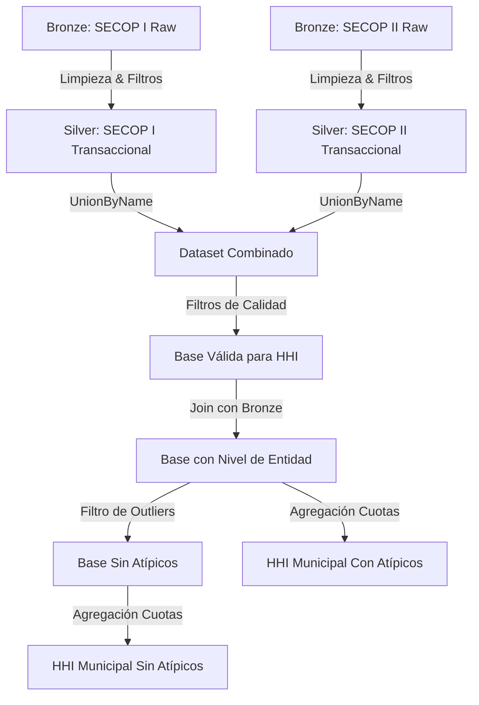

# Informe de Resultados: Análisis de Concentración del Mercado (HHI)
*Metodología de cálculo, transformación de datos en la Arquitectura Medallion e Interpretación Económica (2018-2026).*

---

## 📋 Resumen Ejecutivo

Este informe consolida la metodología de cálculo y el análisis del **Índice Herfindahl-Hirschman (HHI)** para medir el nivel de concentración de la contratación estatal en Colombia. El análisis cubre el periodo **2018-2026** utilizando los datos limpios y estandarizados de la capa **Silver** (transaccional) del pipeline, cruzados con la información de nivel institucional de la capa **Bronze** (SECOP I y SECOP II).

> [!NOTE]
> **Definición del HHI (Herfindahl-Hirschman Index)**
> Es una medida económica utilizada para evaluar la concentración de mercado y el nivel de competencia.
> - **HHI < 1,500:** Mercado altamente competitivo (atomizado).
> - **1,500 <= HHI < 2,500:** Concentración moderada.
> - **HHI >= 2,500:** Alta concentración (oligopolio o tendencia monopólica).
> - **HHI = 10,000:** Monopolio absoluto (un solo oferente captura el 100% de la inversión).

---

## 🛠️ Arquitectura de Datos y Flujo Medallion

Para lograr un cálculo confiable y sin pérdida de datos (superando las limitaciones de los datasets consolidados heredados), se implementó el siguiente flujo:



1. **Capa Bronze (Raw):** Ingesta cruda de SECOP I y II desde los portales de datos abiertos.
2. **Capa Silver (Transaccional):** Estandarización de llaves de municipios (`divipola_key`), limpieza de nombres, y tipado estricto.
3. **Capa Gold (Analítica):** Segmentación por nivel de entidad (`orden_entidad`) mediante un *join* con las columnas crudas de Bronze (`Orden Entidad` y `orden`) y exclusión del 1% superior de contratos atípicos (outliers) por año para evitar distorsiones estadísticas.

---

## 🔬 Ficha Técnica del Dataset Transaccional

El cálculo del HHI parte de la unificación de los registros transaccionales más detallados del SECOP. A continuación se resume la composición del volumen de datos analizado:

*   **Ingesta Inicial en Capa Silver:**
    *   **SECOP I (Histórico y Transaccional):** 5,456,438 registros.
    *   **SECOP II (Transaccional Electrónico):** 4,026,650 registros.
    *   **Total Combinado:** **9,483,088** registros de contratación pública.
*   **Retención por Criterios de Calidad:**
    *   Tras aplicar los filtros de control (eliminar contratos con valor $\le$ 0, NIT de contratista nulo/vacío, y códigos geográficos inválidos), se retuvieron **9,410,511** registros válidos. Esto representa una tasa de retención del **99.23%** del volumen transaccional original, garantizando la cobertura y robustez del cálculo matemático.
    *   **Volumen Parcial para 2026:** Se identificaron **508,712** contratos válidos formalizados en esta vigencia.

---

## 📈 Metodología de Cálculo Paso a Paso

El cálculo del HHI se estructuró en 4 fases lógicas dentro del notebook:

### Paso 1: Filtros de Calidad y Consistencia
Se descartan registros inválidos para asegurar la veracidad de la cuota de mercado:
- Contratos con valor menor o igual a cero (`valor_del_contrato > 0`).
- Registros sin identificación del proveedor o contratista (`nit_contratista`).
- Contratos sin código geográfico válido (`divipola_key`).
- Análisis limitado del año 2018 al 2026.

### Paso 2: Cálculo de Mercado Total y Ventas por Proveedor
Para cada año y municipio, se calcula:
$$\text{Mercado Total} = \sum (\text{valor\_del\_contrato})$$
$$\text{Suma Proveedor} = \sum (\text{valor\_del\_contrato del proveedor en ese municipio-año})$$

### Paso 3: Participación al Cuadrado
Se une la información anterior para calcular la cuota de participación (%) de cada contratista en el municipio y se eleva al cuadrado:
$$\text{Participación Sq} = \left( \frac{\text{Suma Proveedor}}{\text{Mercado Total}} \times 100 \right)^2$$

### Paso 4: Sumatorio del HHI
El HHI del municipio es la suma de los cuadrados de la participación de todos los proveedores activos:
$$\text{HHI}_{\text{municipio-año}} = \sum (\text{Participación Sq})$$

---

## 📊 Principales Hallazgos y Resultados

### 1. Concentración Promedio Nacional (General)

A nivel agregado de municipios, el HHI promedio a nivel nacional se mantiene en un rango **competitivo a moderadamente concentrado** (entre 930 y 1,350). El número de proveedores y municipios cubiertos demuestra la alta capilaridad del sistema de compras del Estado.

| Año | HHI Promedio | Total Municipios | Total Contratos | Suma Inversión (COP) | Proveedores Únicos |
| :---: | :---: | :---: | :---: | :---: | :---: |
| **2018** | 1,045.26 | 1,071 | 1,086,395 | \$102.02 Billones | 528,485 |
| **2019** | 1,341.52 | 1,073 | 1,184,434 | \$137.00 Billones | 573,430 |
| **2020** | 987.68 | 1,077 | 1,163,970 | \$105.44 Billones | 533,552 |
| **2021** | 1,105.82 | 1,080 | 1,338,764 | \$141.10 Billones | 592,724 |
| **2022** | 1,176.52 | 1,084 | 1,120,491 | \$274.85 Billones | 579,145 |
| **2023** | 1,272.38 | 1,081 | 981,651 | \$117.55 Billones | 508,861 |
| **2024** | 936.93 | 1,087 | 968,977 | \$109.66 Billones | 521,362 |
| **2025** | 1,164.71 | 1,087 | 1,057,117 | \$158.56 Billones | 554,179 |
| **2026**\* | 1,244.70 | 1,069 | 508,712 | \$51.27 Billones | 436,794 |

*\*Nota: Los datos para el año 2026 corresponden al corte parcial transaccional registrado en las bases al momento de la ejecución.*

---

### 2. Comportamiento y Anomalías en Bogotá D.C. (Llave DIVIPOLA: 11001)

El mercado en la capital de la República representa históricamente el ecosistema de contratación más grande y, por ende, el más **competitivo (atomizado)** del país. En condiciones ordinarias, Bogotá D.C. cuenta con una pluralidad masiva de oferentes (más de 100,000 proveedores anuales) que mantienen el HHI por debajo de **250** puntos. 

No obstante, la serie temporal revela **dos anomalías de concentración críticas**:

| Año | HHI Bogotá D.C. | Proveedores Únicos | Contratos Totales | Inversión Total (COP) |
| :---: | :---: | :---: | :---: | :---: |
| **2018** | 52.30 | 148,363 | 220,467 | \$49.13 Billones |
| **2019** | 72.10 | 176,303 | 254,941 | \$56.34 Billones |
| **2020** | 229.96 | 93,504 | 134,572 | \$38.15 Billones |
| **2021** | 271.80 | 102,067 | 148,706 | \$59.35 Billones |
| **2022**\* | **5,503.33** | 102,189 | 137,660 | **\$195.36 Billones** |
| **2023** | 72.10 | 110,104 | 153,420 | \$40.90 Billones |
| **2024** | 41.74 | 120,766 | 169,777 | \$35.73 Billones |
| **2025** | 181.42 | 123,852 | 172,178 | \$53.09 Billones |
| **2026**\*\* | **2,127.21** | 90,500 | 97,773 | \$19.20 Billones |

#### Interpretación Económica de las Anomalías en Bogotá:

1.  **La Anomalía de 2022 (HHI = 5,503.33 - Concentración Extrema):**
    En este año, el presupuesto total contratado en Bogotá se triplicó, pasando de un promedio de \$40-\$50 Billones a **\$195.36 Billones**. Esta expansión presupuestal masiva coincide con la adjudicación de megaproyectos de infraestructura de transporte masivo (tales como la licitación de la Segunda Línea del Metro, Troncal de Transmilenio de la Av. 68, y obras viales de gran envergadura). 
    Debido a su tamaño monumental, estos contratos individuales representaron una cuota abrumadora (superior al 60% del mercado agregado del Distrito). Aunque el mercado ordinario de contratación distrital (prestación de servicios, compras menores) siguió atomizado, la suma cuadrática de la participación ponderada por el valor del contrato concentró el índice global hacia el consorcio adjudicatario del megaproyecto, creando un oligopolio matemático extremo.
2.  **La Anomalía de 2026 (HHI = 2,127.21 - Concentración Moderada-Alta):**
    Al tratarse de datos en curso, la concentración al inicio de la vigencia fiscal tiende a sesgarse. Durante los primeros meses del año, las entidades centralizan su presupuesto formalizando contratos interadministrativos de gran cuantía con empresas públicas de servicios o convenios marco nacionales, mientras que la contratación menuda y las licitaciones descentralizadas tardan meses adicionales en publicarse.

---

### 3. Asimetría Estructural: Orden Nacional vs. Orden Territorial

Al segmentar el cálculo del HHI por la procedencia institucional de la entidad contratante, surge una asimetría estructural y geográfica profunda:

*   **Entidades de Orden Nacional (Centralizadas):** Presentan mercados altamente concentrados de manera crónica (HHI promedio de **2,180 a 4,911** con atípicos). Los ministerios, departamentos administrativos y superintendencias nacionales adjudican proyectos de alcance macro y altos presupuestos que son capturados recurrentemente por un grupo especializado y pequeño de proveedores.
*   **Entidades de Orden Territorial (Descentralizadas):** Mantienen un HHI sumamente competitivo a nivel local (HHI promedio entre **900 y 1,350**). Esto refleja la capilaridad de las compras de alcaldías, concejos y gobernaciones, que distribuyen el gasto local en pequeñas cuantías y proveedores locales.

#### El Contraste de Cobertura Geográfica
La distribución espacial del gasto público también muestra dinámicas opuestas:
*   Las compras territoriales irrigan uniformemente la totalidad de la geografía, reportando contratación activa en **más de 1,070 municipios** anualmente.
*   Por el contrario, las entidades nacionales formalizan su contratación territorializada en un grupo muy reducido de municipios (**27 a 124 municipios por año**), usualmente concentrados en capitales departamentales y nodos logísticos de servicios.

---

### 4. El Impacto de los Megaproyectos (Análisis Con vs. Sin Outliers)

Para aislar el efecto distorsionador de los megaproyectos sobre la competencia real en el territorio, se recalculó el HHI **removiendo el 1% de los contratos de mayor valor económico por cada año (Percentil 99)**. 

Este análisis comparativo revela conclusiones cruciales:

#### Tabla Comparativa de HHI Promedio (Con vs. Sin Outliers)

```
       CON ATÍPICOS (Todos los Contratos)          SIN ATÍPICOS (Excluyendo el 1% Superior)
Año  | Nivel Nacional HHI | Nivel Territorial HHI | Nivel Nacional HHI | Nivel Territorial HHI
-----------------------------------------------------------------------------------------------
2018 |      2,180.42      |      1,050.50         |      1,663.92      |        478.67
2019 |      1,813.08      |      1,346.38         |      1,559.30      |        601.62
2020 |      2,078.32      |        984.46         |      1,868.55      |        468.08
2021 |      2,153.22      |      1,106.30         |      1,860.09      |        529.97
2022 |      3,126.14      |      1,182.60         |      2,814.28      |        538.08
2023 |      4,023.37      |      1,277.41         |      3,784.21      |        701.47
2024 |      3,858.99      |        943.16         |      3,657.48      |        656.67
2025 |      3,917.06      |      1,166.96         |      3,386.88      |        663.27
2026 |      4,911.71      |      1,241.15         |      3,786.08      |        752.14
```

> [!IMPORTANT]
> **Hallazgo Clave: El Efecto "Concentración Artificial" en el Gasto Territorial**
> Al remover los contratos del percentil 99, el HHI Territorial se reduce en promedio más de un **50%**, cayendo a niveles ultra-competitivos de **470 a 750 puntos**.
> Esto demuestra empíricamente que la concentración de la contratación en los municipios no es una falla estructural de competencia local, sino un fenómeno provocado exclusivamente por contratos excepcionales de alta cuantía (como una planta de tratamiento o una troncal vial municipal) que sesgan la métrica anual. En contraste, el HHI Nacional se reduce muy poco (menos de un 15% en promedio) y permanece en zonas altamente concentradas y oligopólicas (HHI > 1,500 y hasta > 3,700), confirmando barreras de entrada estructurales y persistencia oligopólica a nivel central.

---

## 📌 Implicaciones y Directrices para Modelado Estadístico

Para los economistas y analistas de datos que deseen utilizar el HHI municipal como variable en modelos econométricos (de crecimiento, formalización de la economía popular o análisis de bienestar social), se definen las siguientes pautas técnicas:

### 1. Control del Sesgo de Escala Municipal
Los municipios con mercados locales muy pequeños (categorías municipales 5 y 6) tienden a reportar HHIs artificialmente elevados por la simple falta de volumen económico. 
*   **Directriz:** Se recomienda utilizar la versión del **HHI sin atípicos (Sin Outliers)** como indicador de competencia de base, y capturar el efecto de la llegada de megaproyectos mediante una variable dicotómica (*dummy*) que registre si el municipio recibió inversión del percentil 99 en el año analizado.

### 2. Segmentación Obligatoria por Orden Administrativo
Combinar compras nacionales y territoriales en un único HHI a nivel municipal oscurece la gobernanza real del gasto. Un municipio puede tener un ecosistema altamente desconcentrado y competitivo en sus compras de alcaldía (Territorial), pero mostrar un HHI municipal agregado distorsionado por un único contrato de infraestructura financiado por la nación (Nacional).
*   **Directriz:** Las especificaciones de regresión o modelos econométricos deben incluir las variables de concentración segmentadas por separado ($HHI_{Territorial}$ y $HHI_{Nacional}$) en lugar de una métrica global unificada.

### 3. Ajuste por Datos en Curso (Vigencia 2026)
Dado el comportamiento temporal de inicio de año documentado en 2026 (donde el HHI agregado se eleva temporalmente debido a la centralización inicial del presupuesto en compras interadministrativas), los modelos econométricos que utilicen series de tiempo completas deben:
*   **Directriz:** Aplicar variables de control de trimestres/meses para mitigar el sesgo de vigencias incompletas, o truncar el análisis hasta la vigencia cerrada del 2025 para asegurar estabilidad estadística completa.

---

## 💾 Descargar Informe
Este informe técnico consolidado y sus datos estructurados de soporte se encuentran disponibles para descarga directa en formato Markdown en la siguiente ruta del espacio de trabajo de consultoría:
📥 **[documentacion_tecnica/INFORME_HHI_DETALLADO.md](file:///c:/Users/Daniela/OneDrive/Escritorio/CONSULTORÍA/desarrollo_social_y_economico-1/documentacion_tecnica/INFORME_HHI_DETALLADO.md)**
