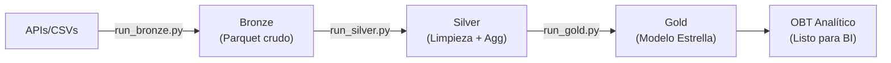

# Guía de Arquitectura Medallion (Bronze, Silver, Gold)

Descripción técnica y decisiones arquitectónicas del pipeline ETL de datos socioeconómicos.

---

## 1. Visión General

El proyecto implementa una **arquitectura Medallion** (Bronze → Silver → Gold) para garantizar:
- **Trazabilidad:** Cada transformación es auditable
- **Calidad:** Validaciones en cada capa
- **Escalabilidad:** Procesamiento de datos gigabytes sin desbordos de memoria
- **Modularidad:** Cada fuente tiene su propio pipeline



---

## 2. Capas de Datos

### 2.1 Capa Bronze — Ingesta Fiel

**Objetivo:** Persistir datos originales sin transformación.

**Ubicación:** `src/ingesta/bronze/` + `datos/bronze/`

**Procesos por Fuente:**

| Fuente | Script | Características |
|--------|--------|-----------------|
| **CNPV 2018** | `ingesta_cnpv.py` | 33 carpetas (1 por depto), 44M+ registros → municipios |
| **SECOP I** | `ingesta_secop_i.py` | Histórico contratos, formato CSV oficial |
| **SECOP II** | `ingesta_secop_ii.py` | Contratos recientes, ~9.6GB (nota: solo sample disponible) |
| **EMICRON** | `ingesta_emicron.py` | Encuesta micronegocios con factores de expansión fex_c |
| **DANE Proyecciones** | `ingesta_proyecciones.py` | Proyecciones poblacionales 2018-2050 |

**Validación Bronze:** Ver `documentacion_tecnica/BRONZE_VALIDATION_REPORT.md`

---

### 2.2 Capa Silver — Limpieza y Agregación

**Objetivo:** Transformar datos crudos en conjuntos homologados y agregados a granularidad municipio-año.

**Ubicación:** `src/transformacion/silver/` + `datos/plata/`

#### Procesos Universales

1. **Normalización de Columnas:**
   - Las fuentes oficiales tienen espacios, tildes, inconsistencias
   - Ej.: `"Cuantía Contrato"` → `cuantia_contrato`
   - Función helper: `_norm()` → NFKD normalize, remove tildes, upper snake_case

2. **Mapeo de DIVIPOLA:**
   - Todas las fuentes se mapean a código DIVIPOLA oficial (5 dígitos)
   - Estrategia: prefiere columna mapeada; fallback a lookup nombre depto+municipio
   - Validación: `str.match(r"^\d{5}$")` — exactamente 5 dígitos

3. **Agregación a Municipio-Año:**
   - PK final: `(divipola_key, anio_key)`
   - Evita inflación: antes de unir fuentes, agregar por (municipio, año)
   - Ejemplo: SECOP con 14k contratos → 1k filas municipio-año

#### Procesos Específicos

**SECOP I + II (clean_secop_i.py, clean_secop_ii.py):**
- Parseo moneda: `$1.234.567` → `1234567` (elimina TODO no-dígito)
- **⚠️ BUG CORREGIDO:** Ver sección 3.1 (regex para moneda)
- Parseo fecha: `DD/MM/YYYY` (SECOP I) o ISO (SECOP II)
- Output dual:
  - `silver_secop_X_agregado.parquet` — municipio-año con COUNT(DISTINCT nit)
  - `silver_secop_X_transaccional.parquet` — contrato-nivel (para deduplicación inter-plataforma)

**CNPV (clean_cnpv.py):**
- Agregación de 44M+ registros individuales a municipio
- Snapshot único (2018)
- Output: `silver_cnpv_agregado.parquet` con `poblacion_total_base`

**EMICRON (clean_emicron.py):**
- Encuesta de micronegocios con factores de expansión `fex_c`
- Agregación depto-año: `volumen_micronegocios_exp = sum(fex_c)`
- Output: `silver_emicron_agregado.parquet`

**DANE Proyecciones (clean_proyecciones.py):**
- Proyecciones 2018-2050, granularidad depto-año
- Agregación depto-año
- Output: `silver_proyecciones_agregado.parquet` con `poblacion_total_proyectada`

---

### 2.3 Capa Gold — Modelo Dimensional

**Objetivo:** Crear una estructura de estrella que facilite análisis multidimensional.

**Ubicación:** `src/transformacion/gold/` + `datos/oro/`

#### Componentes

**Dimensiones Conformadas:**

1. **dim_territorio** (299 filas)
   - Construcción: `build_dimensions.py`
   - Clave: `divipola_key` (5 dígitos)
   - Atributos: nombre municipio, depto, región
   - Fuente: hardcoded dict en `utils/divipola_catalog.py` (limitación: sin CNPV oficial)

2. **dim_tiempo** (12 filas: 2018-2029)
   - Construcción: `build_dimensions.py`
   - Clave: `anio_key`
   - Atributos: es_anio_electoral_presidencial, es_pandemia
   - Define horizonte analítico del mart

**Tablas de Hechos:**

| Tabla | Granularidad | Fuente | PK |
|-------|-------------|--------|-----|
| `fact_contratacion_municipio_anio` | Municipal | SECOP I+II | (divipola_key, anio_key) |
| `fact_censo_municipio` | Municipal | CNPV 2018 | divipola_key |
| `fact_demografia_municipio_anio` | Departamental | DANE | (divipola_key XX000, anio_key) |
| `fact_micronegocios_municipio_anio` | Departamental | EMICRON | (divipola_key XX000, anio_key) |

**⚠️ Nota Crítica:** `fact_demografia` y `fact_micronegocios` son departamentales (XX000), no municipales. Esto requiere lookup especial en el mart (ver sección 3.3).

#### One Big Table (OBT)

**Ubicación:** `datos/oro/marts/latest/mart_desarrollo_social_economico_municipio_anio.parquet`

**Construcción:** `build_mart.py`

**Fórmula de Joins:**

```python
spine = (municipios únicos con al menos 1 hecho) × (años de dim_tiempo)

mart = spine
  .LEFT JOIN dim_territorio (divipola_key)
  .LEFT JOIN dim_tiempo (anio_key)
  .LEFT JOIN fact_contratacion (divipola_key, anio_key)
  .LEFT JOIN fact_demografía (divipola_key[:2]+"000", anio_key)  # lookup depto
  .LEFT JOIN fact_micronegocios (divipola_key[:2]+"000", anio_key)  # lookup depto
  .LEFT JOIN fact_censo (divipola_key)
```

**Tamaño Final:** 3,129 filas × ~25 columnas

**Indicadores Derivados:**
- `indicador_inversion_per_capita = inversion_total_monto / poblacion_total_proyectada`
- `indicador_densidad_micronegocios = volumen_micronegocios_exp / poblacion_total_proyectada`

---

## 3. Bugs Encontrados y Soluciones

### 3.1 SECOP II — Valores Monetarios 99.6% Cero

**Síntoma Identificado:**
```
silver_secop_ii_transaccional.parquet:
  inversion_total_monto: 14,656 zeros / 14,738 registros (99.6%)
  Max value: 999,018 COP (claramente inválido)
```

**Causa Raíz:**

Archivo: `src/transformacion/silver/cleaners/clean_secop_ii.py` (líneas 47-52)

```python
# CÓDIGO ORIGINAL (FALLIDO)
_MONEDA_RE = re.compile(r"[^\d\-\.]")  # ← Mantiene período en charset

def _parse_valor(s: pd.Series) -> pd.Series:
    s2 = s.astype(str).str.replace(",", ".", regex=False)  # Reemplaza coma por punto
    s2 = s2.str.replace(_MONEDA_RE, "", regex=True)        # Quita TODO excepto dígito, signo, PUNTO
    s2 = s2.replace("", None)
    return pd.to_numeric(s2, errors="coerce").fillna(0.0)
```

**Problema Detallado:**

1. Input SECOP II: `$23.300.213` (formato colombiano, punto = miles separator)
2. Después `str.replace(",", ".")`: `$23.300.213` (sin cambios, no hay comas)
3. Regex `[^\d\-\.]` mantiene puntos → resultado: `23.300.213` (múltiples puntos)
4. `pd.to_numeric("23.300.213")` → **NaN** (no puede parsear múltiples decimales)
5. `fillna(0.0)` → **0**

En cambio, SECOP I usaba:
```python
_MONEDA_RE = re.compile(r"[^\d\-]")  # ← SIN período en charset
```
Y funcionaba correctamente.

**Solución Implementada:**

```python
# CÓDIGO CORREGIDO
_MONEDA_RE = re.compile(r"[^\d\-]")  # ✅ Sin período

def _parse_valor(s: pd.Series) -> pd.Series:
    """$1.234.567 -> 1234567 (elimina TODO lo no dígito; formato colombiano con punto como miles)."""
    s2 = s.astype(str).str.replace(_MONEDA_RE, "", regex=True).replace("", None)
    return pd.to_numeric(s2, errors="coerce").fillna(0.0)
```

**Lógica:**
1. Input: `$23.300.213`
2. Regex `[^\d\-]` elimina TODOS los no-dígitos → `23300213` (solo dígitos)
3. `pd.to_numeric("23300213")` → **23300213** ✅
4. Resultado: numérico válido

**Verificación Post-Fix:**

```
Antes:  14,656 ceros (99.6%), max = 999,018
Después: 82 ceros (0.6%), max = 54,853,329,383
```

---

### 3.2 Mart — Años Espurios 2030-2050

**Síntoma Identificado:**
```
OBT contenía 6,825 filas
Debería tener ~3,129 filas
Años incluidos: 2018-2050 (33 años) en lugar de 2018-2029 (12 años)
```

**Causa Raíz:**

Archivo: `src/transformacion/gold/build_mart.py` (líneas 92-109)

```python
# CÓDIGO ORIGINAL (FALLIDO)
pares = []
for df_ in (f_cnt, f_mic, f_dem):  # fact_demografia cubre 2018-2050
    if not df_.empty and "divipola_key" in df_.columns and "anio_key" in df_.columns:
        sub = df_[["divipola_key", "anio_key"]].dropna().copy()
        pares.append(sub)

if pares:
    spine = pd.concat(pares, ignore_index=True).drop_duplicates()
    # ❌ spine contiene años 2030-2050 de DANE, aunque no están en dim_tiempo
```

**Problema:**
- `fact_demografia` contiene proyecciones DANE hasta 2050 (rango futuro completo)
- `dim_tiempo` define el horizonte analítico: 2018-2029
- Sin filtro, spine incluía años fuera del rango que el OBT debería analizar

**Solución Implementada:**

```python
# CÓDIGO CORREGIDO
anios_validos = set(dim_tiempo["anio_key"].dropna().astype(int).tolist())

pares = []
for df_ in (f_cnt, f_mic, f_dem):
    if not df_.empty and "divipola_key" in df_.columns and "anio_key" in df_.columns:
        sub = df_[["divipola_key", "anio_key"]].dropna().copy()
        sub["anio_key"] = pd.to_numeric(sub["anio_key"], errors="coerce").astype("Int64")
        sub = sub[sub["anio_key"].isin(anios_validos)]  # ✅ Filtrar
        pares.append(sub)
```

**Verificación Post-Fix:**

```
Antes:  6,825 filas, años 2018-2050
Después: 3,129 filas, años 2018-2029 ✅
```

---

### 3.3 Mart — Indicador Per-Cápita Siempre NaN (Granularidad Mismatch)

**Síntoma Identificado:**
```
poblacion_total_proyectada: 396 / 3,129 (12.6%) populated
indicador_inversion_per_capita: 0 / 3,129 (100% NaN)
```

**Causa Raíz — Mismatch de Granularidad:**

Archivo: `src/transformacion/gold/build_mart.py` (líneas 139-148)

**Problema Conceptual:**

| Fuente | Granularidad | DIVIPOLA Ejemplo |
|--------|-------------|-----------------|
| `fact_contratacion` | **Municipal** | `05001` (Medellín), `08001` (Cali), `08002` (Yumbo) |
| `fact_demografia` | **Departamental** | `05000` (Antioquia), `08000` (Valle) |
| `fact_micronegocios` | **Departamental** | `05000` (Antioquia), `08000` (Valle) |

La columna DIVIPOLA tiene **5 dígitos**:
- **[0:2]** = código departamento (05, 08, etc.)
- **[2:5]** = código municipio dentro depto (001 = capital, 002 = segundo, etc.)
- **Convención XX000** = "agregado de TODO el depto"

**Código Original (Fallido):**

```python
df = df.merge(f_cnt, on=["divipola_key", "anio_key"], how="left")
df = df.merge(f_mic, on=["divipola_key", "anio_key"], how="left")  # ❌ JOIN fallido
df = df.merge(f_dem, on=["divipola_key", "anio_key"], how="left")  # ❌ JOIN fallido
```

**Lógica del Fallo:**

```
Spine después contratación:
  divipola_key  anio_key
  05001         2018      ← Medellín (municipio específico)
  05002         2018      ← Bello (municipio específico)

fact_demografia:
  divipola_key  anio_key  poblacion_total_proyectada
  05000         2018      12,000,000  ← Antioquia COMPLETO (agregado depto)

JOIN en (divipola_key, anio_key):
  (05001, 2018) ≠ (05000, 2018)  ❌ NO COINCIDE
  (05002, 2018) ≠ (05000, 2018)  ❌ NO COINCIDE

Resultado: poblacion_total_proyectada = NULL para TODAS las filas municipales
```

**Solución Implementada — Lookup Departamental:**

```python
# CÓDIGO CORREGIDO
df = df.merge(f_cnt, on=["divipola_key", "anio_key"], how="left")

# fact_micronegocios y fact_demografia son de granularidad DEPARTAMENTAL
# (divipola XX000). Para municipios se hace lookup por código departamental
# (primeros 2 dígitos + "000") de modo que cada municipio hereda los
# indicadores del agregado departamental al que pertenece.

# Paso 1: Derivar código depto
df["_div_depto"] = df["divipola_key"].str[:2] + "000"

# Paso 2: Preparar facts para join en depto
f_mic_join = f_mic.rename(columns={"divipola_key": "_div_depto"})
f_dem_join = f_dem.rename(columns={"divipola_key": "_div_depto"})

# Paso 3: JOIN en código depto (no municipal)
df = df.merge(f_mic_join, on=["_div_depto", "anio_key"], how="left")
df = df.merge(f_dem_join, on=["_div_depto", "anio_key"], how="left")

# Paso 4: Limpiar
df = df.drop(columns=["_div_depto"])
```

**Lógica Correcta:**

```
Spine después contratación:
  divipola_key  anio_key
  05001         2018      ← Medellín

Derivar depto:
  divipola_key  anio_key  _div_depto
  05001         2018      05000      ← derivado: "05" + "000"

fact_demografia (renombrada):
  _div_depto  anio_key  poblacion_total_proyectada
  05000       2018      12,000,000

JOIN en (_div_depto, anio_key):
  (05000, 2018) = (05000, 2018)  ✅ COINCIDE!

Resultado: poblacion_total_proyectada = 12,000,000 ✅
```

**Verificación Post-Fix:**

```
Antes:  poblacion_total_proyectada: 396/3,129 (12.6%)
        indicador_inversion_per_capita: 0/3,129 (0%)

Después: poblacion_total_proyectada: 3,129/3,129 (100%)
         indicador_inversion_per_capita: 1,034/3,129 (33%)

Ejemplo Medellín 2018:
  inversion_total_monto = 102,048,303,872 COP
  poblacion_total_proyectada = 6,407,149 personas
  indicador_inversion_per_capita = 15,929 COP/persona ✅
```

---

## 4. Estado Actual Post-Fixes

### Verificación de Integridad

**Dimensiones:**
- ✅ `dim_territorio`: 299 municipios, sin nulos en PK
- ✅ `dim_tiempo`: 12 años (2018-2029), sin nulos

**Tablas de Hechos:**
- ✅ `fact_contratacion`: 1,035 filas, PKs únicos, 0 nulos
- ✅ `fact_censo`: 143 filas (CNPV 2018), 0 nulos
- ✅ `fact_demografia`: 1,089 filas (depto-año, 2018-2050), 0 nulos en depto
- ✅ `fact_micronegocios`: 25 filas (depto-año, EMICRON 2024), 0 nulos

**OBT Final:**
- ✅ 3,129 filas municipio-año
- ✅ 295 territorios únicos (cobertura)
- ✅ Años 2018-2029 (correct horizon)
- ✅ PKs: 0 nulos, 0 duplicados
- ✅ Per-cápita: 1,034 calculados (33% con inversión)

---

## 5. Decisiones Arquitectónicas Clave

### 5.1 Agregación Pre-Join (Anti Fan-Out)

**Decisión:** Agregar a municipio-año ANTES de unir distintas fuentes.

**Justificación:** Evita inflación de registros. Ejemplo:
- Si SECOP contiene 14k contratos en Medellín 2018
- Sin agregación previa: 14k filas × fact_demografia × fact_censo = explosión
- Con agregación: 1 fila municipio-año en cada fact → 1 fila en OBT ✅

### 5.2 Lookup Departamental para Demografía

**Decisión:** Unir demografía (XX000) a municipios (XXXXX) mediante código depto.

**Justificación:** DANE y EMICRON no publican datos municipales. Aproximación estándar: heredar indicadores del agregado departamental.

### 5.3 Transaccional + Agregado en Silver

**Decisión:** Guardar ambos niveles en Silver para SECOP I/II.

**Justificación:**
- Transaccional: permite COUNT(DISTINCT nit) global (sin doble conteo inter-plataformas)
- Agregado: respaldo si se pierden transaccionales

---

## 6. Limitaciones Conocidas

| Limitación | Impacto | Motivo |
|-----------|--------|--------|
| `dim_territorio`: 299 vs 1,122 municipios | Media | DIVIPOLA oficial CSV no disponible |
| SECOP II: solo sample (43MB) | Bajo | Full file (9.6GB) no en repo |
| EMICRON: 25 filas (2024) | Bajo | Encuesta anual limitada |
| CNPV: 143 municipios | Medio | Solo departamentos con archivo disponible |

---

## 7. Referencias

- **Ingesta, Validación, Cruce Completa:** `documentacion_tecnica/INGESTA_VALIDACION_CRUCE.md`
- **Validaciones Bronze:** `documentacion_tecnica/BRONZE_VALIDATION_REPORT.md`
- **Data Contracts:** `documentacion_tecnica/DATA_CONTRACTS.md`
- **Deduplicación SECOP:** `documentacion_tecnica/VALIDACION_NO_DOBLE_CONTEO_PROVEEDORES.md`

---

**Última actualización:** 2026-04-23  
**Estado:** ✅ Todos los bugs corregidos y documentados  
**Responsable:** Johann Sebastian
