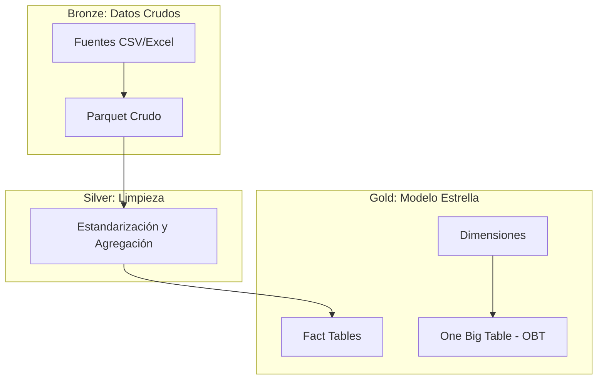

# Guía de Arquitectura Medallion (Bronze, Silver, Gold)

Este documento describe el diseño técnico, las capas de datos y los procesos de transformación del proyecto.

---

## 1. Visión General de la Arquitectura
El proyecto utiliza una arquitectura de datos **Medallion** para garantizar la trazabilidad y calidad de la información socioeconómica.

---

## 2. Capas de Datos

### 2.1 Capa Bronze (Ingesta)
- **Objetivo:** Persistencia fiel de los datos originales en formato Parquet.
- **Validación:** Se verifica la integridad de los archivos y se generan hashes de seguimiento.
- **Estructura:** `datos/bronze/<fuente>/`.

### 2.2 Capa Silver (Limpieza y Homologación)
- **Objetivo:** Transformar datos crudos en conjuntos de datos limpios y listos para el análisis.
- **Procesos:**
  - Homologación de códigos DIVIPOLA.
  - Conversión de tipos de datos.
  - Manejo de nulos y duplicados.
  - Agregación al grano `(Municipio, Año)`.
- **Estructura:** `datos/plata/`.

### 2.3 Capa Gold (Modelo Estrella y Marts)
- **Objetivo:** Modelado dimensional para facilitar el consumo analítico.
- **Componentes:**
  - **Dimensiones:** `dim_territorio`, `dim_tiempo`.
  - **Hechos:** `fact_contratacion`, `fact_micronegocios`, `fact_demografia`.
- **Salida Final:** One Big Table (OBT) en `datos/oro/marts/latest/`.

---

## 3. Diseño del Modelo de Datos
- **Unidad de Análisis:** `Municipio - Año`.
- **Justificación:** Es la intersección espacio-temporal mínima común entre SECOP, EMICRON y CNPV.
- **Evita Inflación:** Al agregar antes de unir, se previene la duplicidad de indicadores sociales por cada contrato.

---

## 4. Reportes de Calidad y Validación
- El pipeline genera reportes automáticos en `documentacion_tecnica/` para cada etapa.
- **Validación de Cruces:** Se asegura que las sumatorias poblacionales y montos de inversión se mantengan consistentes tras los joins.
- **Manejo de Ceros:** Se previene la división por cero en indicadores per-cápita mediante filtrado preventivo en la capa Gold.

---

## 5. Cierre de Evidencia (Silver -> Gold)
La transición de Silver a Gold ha sido validada técnicamente:
- Los artefactos de Silver son consumidos correctamente por `build_facts.py`.
- La dimensión territorial se expande dinámicamente para incluir nuevos municipios detectados en las fuentes.
