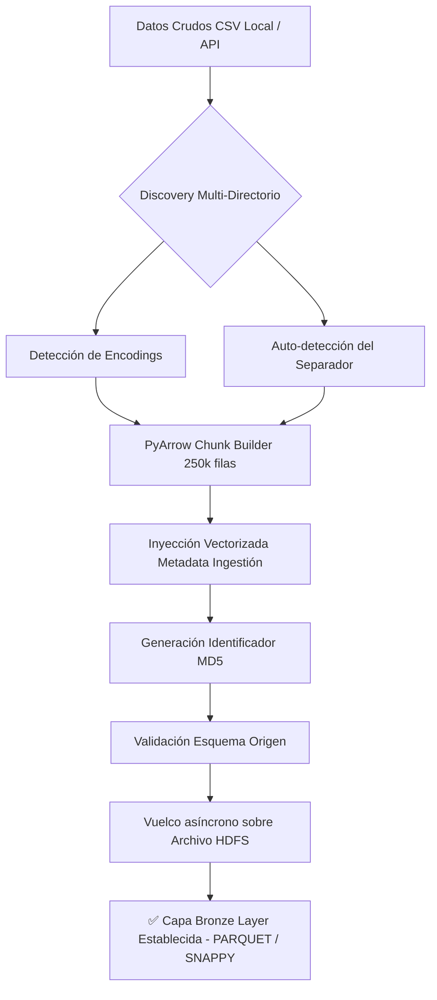

# 📄 Informe Técnico de Ingesta y Validación (Bronze Layer)

**Proyecto**: Sinergia Socioeconómica entre el Territorio y el Gasto Público
**Arquitectura**: Medallion Data Architecture
**Motor de Procesamiento**: Python, PyArrow, Pandas
**Formato de Almacenamiento**: Apache Parquet (Compresión Snappy)

---

## 1. Introducción y Justificación de la Arquitectura

La ingesta de datos constituye la **Capa Bronze (Raw)** del pipeline analítico del proyecto. Dada la masividad de los microdatos manejados, las estrategias tradicionales de procesamiento basado en memoria (`pd.read_csv` sobre archivos completos) resultaban viables únicamente para fuentes pequeñas. 

Al enfrentarnos a fuentes como el **Censo Nacional de Población y Vivienda (CNPV) con ~6 GB**, **SECOP I con ~10.5 GB** y **SECOP II con ~9.6 GB**, fue imperativo diseñar un orquestador de ingesta optimizado para el procesamiento "Out-of-Core" (más allá de la memoria RAM disponible). 

### Decisiones de Diseño Críticas
1. **Paso a Formato Columnar (Apache Parquet)**: Todos los CSVs crudos se transforman inmediatamente a Parquet. Esto reduce dramáticamente el peso en disco (hasta un 80% menos mediante compresión `snappy`), tipifica los datos (evitando inferencias de tipo en cálculos posteriores) y habilita la *proyección de columnas* (leer solo lo necesario) en las subsecuentes capas Silver y Gold manejadas por DuckDB y PySpark.
2. **Procesamiento por Fragmentos (Chunking)**: Implementación nativa de iteradores de Pandas y PyArrow en lotes de `250,000` registros. Esto garantiza que el uso de RAM se mantenga plano (alrededor de 1-2 GB de overhead), previniendo errores `OOM (Out Of Memory)` en los equipos locales de los desarrolladores.
3. **Desacoplamiento Estructural**: El orquestador `main_ingestion.py` opera mediante inyección de dependencias (`SOURCES_CONFIG`). Cada fuente de datos cuenta con un *parser* (`parser_csv_*.py`) aislado, que hereda un contrato para retornar el mismo estándar de metadatos independiente de la lógica que aplique por debajo.
4. **Portabilidad Absoluta**: Supresión total de rutas estáticas forzadas (hardcoding).

### El Rol Fundacional para PySpark (Integración Silver/Gold)
La ingesta hacia Parquet no es un fin en sí mismo, sino un requisito técnico estricto para habilitar la **Capa Silver y Gold**. 
En estas etapas posteriores se levanta un clúster local de **PySpark** (`master="local[*]"`) diseñado para cruzar múltiples bases de datos gigantescas (Cruce de Contratos Electrónicos SECOP vs. 50 millones de personas del Censo). 
- PySpark lee los Parquet generados en la Ingesta de forma *Lazy* (diferida).
- Esto permite hacer agrupaciones y JOINs "Out-of-Core", lo cual es vital, pues un cruce de 20GB en memoria Pandas colapsaría el equipo del analista, mientras que PySpark lo consolida en el **Modelo Estrella (Data Marts)** en cuestión de minutos.
- Asimismo, la capa Bronze garantiza compatibilidad nativa con **DuckDB** / **PyArrow Datasets** en caso de que el entorno del usuario (*ej. Python 3.12 en Windows*) tenga fallos ejecutando la Máquina Virtual de Java (Engine Agnóstico).

---

## 2. Ingesta Multi-Fuente: Detalle Técnico

### 2.1 Censo Nacional de Población y Vivienda (CNPV 2018)
* **Volumen Demográfico**: ~50 Millones de registros (aprox 6 GB dispersos en 33 carpetas departamentales).
* **Estrategia técnica**: El `parser_csv_cnpv.py` utiliza la biblioteca nativa `pathlib.Path.rglob()` para recorrer múltiples directorios recursivamente, detectando y procesando secuencialmente cada uno de los CSV correspondientes a las entidades territoriales, asegurando que la carga y anexión al master Parquet sea estable.

### 2.2 SECOP II (Contratos Electrónicos)
* **Volumen Transaccional**: ~9.6 GB (único archivo masivo).
* **Refactorización de Lógica**: Inicialmente concebido con cargas convencionales, el parser `parser_csv_secop.py` fue refactorizado a fondo. Se abandonó el llamado completo a Pandas en detrimento de un iterador (`chunksize=250000`). Cada *chunk* temporal se procesa e inmediatamente se vuelca a disco para liberar el Garbage Collector (GC) de Python, consolidando un único archivo Parquet estructurado.

### 2.3 SECOP I (Procesos de Compra Pública)
* **Volumen Histórico**: ~10.5 GB de registro histórico albergado localmente desde datos.gov.co.
* **Aislamiento Funcional**: Se creó un `parser_csv_secop_i.py` independiente del pipeline de SECOP II. Dada la sensibilidad del histórico, se aplicó la misma estricta regla de chunking. Mapea los tipos de datos en la carga delegando la limpieza morfológica pura a la capa Silver.

### 2.4 EMICRON (Encuesta de Micronegocios DANE) — Ingesta Multi-Año
* **Complejidad Estructural**: ~70 archivos CSV anidados en 6 directorios mayores (2019 a 2024), con múltiples módulos temáticos por año.
* **Ingeniería de Detección**: El `parser_csv_emicron.py` fue revolucionado para ser dinámico. El parser ahora auto-descubre iterativamente (mediante expresiones regulares `r"EMICRON\s+(\d{4})"`) qué años están disponibles en el disco duro. 
* **Normalización de Formatos Híbridos**: Al recorrer los años del DANE, se programó un gestor de excepciones que preconfiguró listas de encoding (`utf-8`, `latin-1`, `cp1252`) y detecta dinámicamente el separador (el DANE usó `;` en 2019 pero `,` a partir de 2022).
* **Inyección de Identidad**: Se incluye la inyección en tiempo de ejecución del campo `_emicron_year` a todos los dataframes procesados. De este modo, en Silver Layer, se podrán concatenar los Parquets conservando la dimensionalidad cronológica y temporal de los micronegocios sobrevivientes al COVID-19.

### 2.5 Proyecciones Censales de Población (DANE)
* **Volumen de Ajuste**: Dataset ligero (~140 KB).
* **Objetivo de Pipeline**: Asegura que el pipeline no fracase por falta del diccionario maestro poblacional y los ponderadores en niveles geográficos finos.

---

## 3. Resolución de Rutas Dinámicas y Entornos de Trabajo (Team-Friendly)

Con el propósito de democratizar la ejecución del proyecto entre investigadores con diversas configuraciones de Sistema Operativo, se diseñó un protocolo de mitigación de rutas.

1. **Jerarquía Relativa (Glob Patterns)**: La configuración `settings.py` implementa `_resolve_glob_path()`. Este método instruye al pipeline para inspeccionar su directorio padre en busca de una carpeta `Datos/`. Seguidamente, utiliza comodines glob (`SECOP_I_*.csv`) para anexar los datasets sin importar el prefijo de fecha de descarga subyacente.
2. **Overrides Volátiles (.env)**: Si la arquitectura de carpetas predeterminada es disruptiva para algún dev, el orquestador adopta un parseo nativo priorizando cualquier `PATH` declarado explícitamente en `.env`, el cual es invisible a Git para prevenir la sobreescritura accidental entre desarrolladores.

---

## 4. Auditoría, Metadata y Hashing de Datos

Ningún bloque de datos que ingrese a la Capa Silver está libre de auditoría. Cada parser instanciado en el flujo Bronze adhiere cinco columnas de Metadata generadas algorítmicamente en tiempo real durante las iteraciones de ingesta activa:

- `_ingestion_timestamp`: ISO Timestamp local exacto del procesamiento.
- `_source`: Identificador referencial sistémico de la fuente.
- `_source_version`: Descriptor semántico de versión.
- `_extraction_method`: Registro del pipeline interviniente (`CSV_LOCAL` / `CHUNKED`).
- `_checksum_md5`: Hash computado sintéticamente (basado en el volcado de string del conjunto) que verifica la preservación bit-a-bit y previene errores sutiles de paridad durante el ciclo transaccional masivo de I/O de disco duro, asegurando la no-corrupción durante el particionamiento hacia el standard open-source Parquet.

### Validación de Esquema 
Existe un componente nativo de validación alimentado por diccionarios preconfigurados. Durante la importación, si se detecta divergencia ("Schema Drift") en la morfología subyacente aportada por la API central versus los tensores predefinidos, el sistema alerta asíncronamente vía log handlers que la completitud original (Completeness) difiere de los modelos en producción.

---

## 5. Resumen de Flujo de Operación Actual (Workflow)

La centralización de la ingesta proporciona velocidad y tolerancia a fallos frente a datasets multianuales masivos, minimizando drásticamente la latencia de transformación en etapas posteriores (PySpark / DuckDB) al evitar costosos casteos implícitos iterativos de los tipos primitivos subyacentes.
